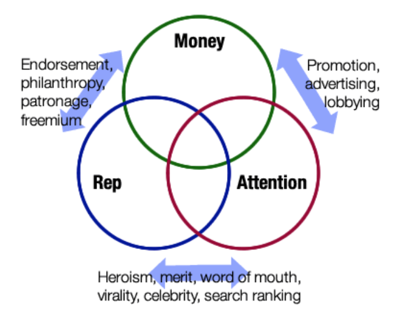

.. _attention-and-reputation-economy:

################################################################################
Attention & Reputation Economy
################################################################################

From a user-centric perspective, this economy aims to directly but unobstructedly allow value to be placed on the content’s creation, consumption, and promotion. This applies to many types of content.  For example, a short textual post is created, sent to an initial distribution list, read, promoted (liked), and made available to even more readers. Or, a short movie can go through the same workflow. Along these paths, attention is given, and rewards can flow back to the content originator and to promoters. Based on one’s own engagement with the content exchanged to/from one’s connections, each connection’s reputation is computed. The reputation rank can be used subsequently to present content in a manner consistent with how the user has demonstrated attention in the recent past.

For more information, see the original whitepaper, `RChain - The Decentralized and
Distributed Social Network`_. The latest thinking about Attention & Reputation Economy
will be described in Slack discussions and blog posts.

    3economiesvenn.png [#f1]_

.. [#f1] Croll, Alistair (2009) - http://human20.com/free-reputation-for-everyone-the-three-non-traditional-economies/

.. _RChain - The Decentralized and Distributed Social Network: http://www.synereo.com/whitepapers/synereo.pdf
