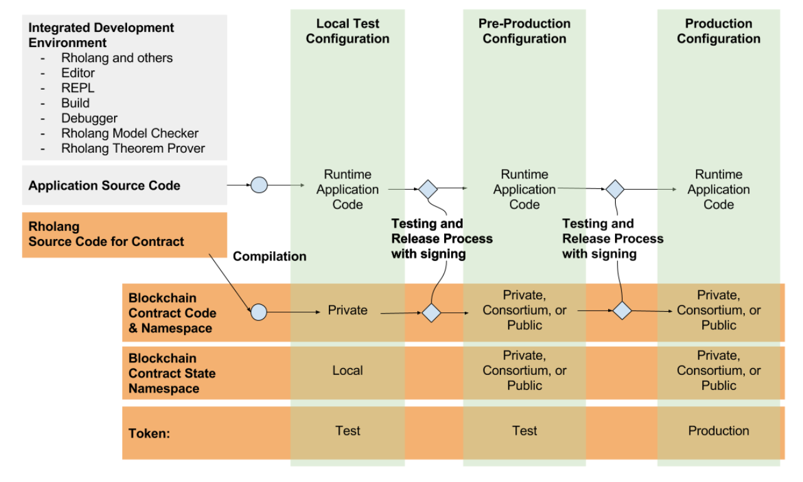

.. _contract-development-and-deployment:

################################################################################
Contract Development & Deployment
################################################################################

The purpose of this next discussion is to illustrate how namespaces allow for heterogeneous deployment of contracts and contract state. Namespaces is one of the crucial features for sharding, and with that we get the benefits analogous of sidechains, private chains, consortium chains, as well as the distinction between test and production, all under one rubric.

For example, the following diagram depicts some of the possible development, test, and deployment configurations and considerations, and how release management is enabled using namespaces and sharding.

We’ll collaborate with IDE tool vendors to integrate Rholang and validation tools.
