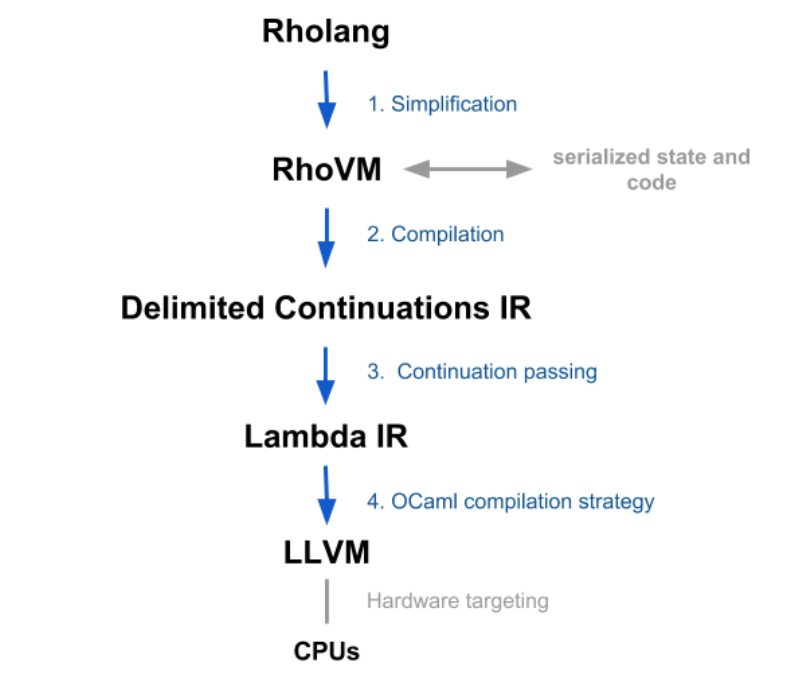

.. _contracts:

###############################################################################
Contracts
###############################################################################

An RChain contract is a well-specified and well-behaved program that interacts
with others. Contract interaction with clients or other contracts is via transactions.

When the contract at a given state needs to be evaluated, it is read from the blockchain and deserialized into RhoVM intermediate representation (IR) of the contract with its state parameters. This is via a delimited continuation pattern. The RhoVM IR is compiled into another VM format that is then executed. After the contract is run to its next transaction state, the resulting state is serialized and again stored on the blockchain.

Contract Execution Model, Rholang, and RhoVM
===============================================================================

This section describes the essential requirement for decentralized concurrency in Internet-scale applications, along with the compute models and programming languages that best suit that requirement. Rholang is introduced, which is a behaviorally typed, reflective, higher-order process language.

Concurrency Requirements
===============================================================================

A platform supporting a global, decentralized compute utility that supports a wide variety of applications must scale, and concurrency is essential to achieve that. Transactions that do not interact must be able to complete at the same time, because to enforce a sequencing constraint forces all nodes to process all transactions. Such a sequencing constraint is essentially what causes blockchains in their current form to be fundamentally unscalable.

When we say “concurrency”, we’re not just talking about multi-threaded implementation of functions, but handling of non-blocking I/O and concurrent processes within and across nodes. The Internet itself is built out of billions of autonomous computing devices each of which is executing programs concurrently with respect to the other devices, but also concurrently on the devices themselves, as most modern hardware supports native multi-threading capability. Decentralization places special emphasis on the autonomy and independence of devices and programs running on them. The APIs of centralized trusted third parties, which programmers could pretend were part of a giant sequential computer, will become a thing of the past. Even inside those organizations sequential architecture is giving way to lots and lots of autonomously executing microservices.

Mobile Process Calculi
===============================================================================

There are relatively few programming paradigms and languages that handle concurrent processes in their core model. Instead, they bolt some kind of threading-based concurrency model on the side to address being able to scale by doing more than one thing at a time. Mobile process calculi provides one model, which we’ve chosen. They provide a fundamentally different notion of what computing is. In these models, computing arises primarily from the interaction of processes.

The family of mobile process calculi provides an optimal foundation for a system of interacting processes. Among these models of computation, the applied π-calculus stands out. It models processes that send queries over channels. This approach maps very well onto today’s Internet and has been used as the tool of choice for reasoning about a wide variety of concerns essential for distributed protocols.

Beyond this basic fit with the way the Internet computes, the mobile process calculi have something else going for them: behavioral types. Behavioral types represent a new kind of typing discipline that constrains not only the shape of input and output, but the permitted order of inputs and outputs among communicating processes. Getting concurrency right is hard, and support from this kind of typing discipline will be extremely valuable to ensure end-to-end correctness of a large system of communicating processes.

Rho-calculus
===============================================================================

Even a model based on the applied π-calculus and equipped with a behavioral typing
discipline is still not quite the best fit for a programming language for the
decentralized Internet, let alone a contracting language for the blockchain.
There’s another key ingredient: The rho-calculus, a variant of the π-calculus,
was introduced in 2004 and provided the first model of concurrent computation with
reflection. Reflection is now widely recognized as a key feature of practical
programming languages. Java, C#, Scala, have eventually adopted reflection as a
core feature, and even OCaml and Haskell have ultimately developed reflective versions.
The reason is simple: at industrial scale, human agency is at the end of a very
long chain of programs operating on programs. Programmers use programs to write
programs, because without the computational leverage it would take too long to
write them at industrial scale. Reflection is one of the key features that
enables programs to write programs, providing a disciplined way to turn programs
into data that programs can operate on and then turn the modified data back into
programs. Lisp programmers have known for decades how powerful this feature is
and it took the modern languages some time to catch up to that understanding.
The rho-calculus is the first computational model to combine all of these core
requirements: behaviorally typed, fundamentally concurrent, message-passing model,
with reflection. For details, see `A Reflective Higher-order Calculus`_.

.. _A Reflective Higher-order Calculus: http://www.sciencedirect.com/science/article/pii/S1571066105051893

Rholang
===============================================================================

Rholang is a fully featured, general purpose, Turing complete programming language
built from the rho-calculus. Rholang is RChain’s smart contract language. To get a
taste of Rholang, here’s a contract named Cell that holds a value and allows clients
to get and set it:

.. code-block:: scala

  data Request[a] = Get(Ch[a]) | Set(a)

  contract Cell(client: Ch[Request[a]], state: Ch[a]) = {
    select {
      case(Get(rtn) << client; value := state) {
        rtn!(value)
      }
      case(Set(newValue) << client; value <- state) {
        state!(newValue)
      }
    }
  }

The language is concurrency-oriented, with a focus on message-passing through channels.
Channels are statically typed and can be used as single message-pipes, streams or used
to store data. Similarly to typed functional languages, it supports algebraic data types
and deals with immutable values. It supports formal verification through the use of
behavioral types.

A document introducing Rholang in more detail is being produced.

RhoVM
===============================================================================

The compiled RhoLang contract is executed in a Rho virtual machine (RhoVM). This
virtual machine is derived from the computational model of the language, similar
to other programming languages such as Scala and Haskell. In other words, there
will be a tight coupling between Rholang and its VM, ensuring correctness. This
VM is the machine that will be executed by the compute utility, and we call it
RhoVM. To allow clients to execute the VM, we’ll build a compiler pipeline that
starts with VM code that is compiled into intermediate representations (IRs) that
are progressively closer to the metal, with each translation step being either
provably correct, commercially tested in production systems, or both.

This pipeline is illustrated in the figure below:

Let’s describe these steps in more detail:

* **Simplification.** From programs written in the Rholang contracting language or from another contract language, this step includes:  a) injection of code for the rate-limiting mechanism, b) desugaring of syntax, and c) simplification for functional equivalencies. The result targets the RhoVM IR. Note, the state of the RhoVM can be serialized/deserialized to/from storage such as the blockchain.
* **Compilation.** From the RhoVM IR to a Delimited Continuations IR.
* **Continuation Passing.** From Delimited Continuations IR to a Lambda IR. This compilation follows a translation pattern from delimited continuations to a traditional continuation-passing style that has been proven correct.
* **OCaml Compilation Strategy.** From code on a Lambda IR to LLVM, as in the  OCaml compiler. Note that LLVM Core libraries provide a modern source- and target-independent optimizer, along with code generation support for many popular CPUs.

For more details see the #rho-lang channel on the RChain Slack (`here`_ or `join`_).
Early compiler work can be seen on `GitHub`_ and discussion on `Gitter`_.

.. _here: https://synereonet.slack.com/messages/rho-lang/details
.. _join: http://slack.synereo.com
.. _GitHub: https://github.com/weeeeeew/rholang
.. _Gitter: https://gitter.im/synereo/rholang

Formal Specification
===============================================================================

Rholang will be formally specified, and we are investigating a few frameworks
such as `K-Framework`_ to achieve this.

.. _K-Framework: http://www.kframework.org

Model Checking, Theorem Proving, and Composition of Contracts
===============================================================================

In the RhoVM and potentially in upstream contracting languages, there are a variety of techniques and checks that will be applied during compile-time and runtime. These help address requirements such as how a developer and the system itself can know a priori that contracts that are well-typed will terminate.

Formal verification will assure end-to-end correctness via model checking (such as in SLMC) and theorem proving (such as in Pro Verif). Additionally, these same checks can be applied during runtime as newly proposed assemblies of contracts are evaluated.

Discovery Service
===============================================================================

An advanced discovery feature that will ultimately be implemented enables searching for compatible contracts and assembling a new composite contract from of other contracts. With the formal verification techniques, the author of the new contract can be guaranteed that when working contracts are plugged together they will also work together.

Validation and Casper Consensus Protocol
===============================================================================

Nodes that take on the validation role have the function to achieve consensus on the blockchain state. Validators also assure a blockchain is self-consistent and hasn’t been tampered with and protect against Sybil attack.

The Casper consensus protocol includes stake-based bonding, unbonding, and betting cycles that result in consensus. The purpose of a decentralized consensus protocol is to assure consistency of blockchains or partial blockchains (based on shards), across multiple nodes. To achieve this any consensus protocol should produce an outcome that is a proof of the safety and termination properties of class of consensus protocols, under a wide class of fault and network conditions.

RChain’s consensus protocol uses stake-based betting, similar to Ethereum’s Casper
design. This is called a “proof-of-stake” protocol by the broader blockchain community,
but that label leads to some misperceptions including overstated centralization risks.
Validators are bonded with a stake, which is a security deposit placed in an escrow-like
contract. Unlike Ethereum’s betting on a whole blocks, RChain’s betting is on logical
propositions. A proposition is a set of statements about the blockchain, for example:
which transactions (i.e. proposed state transitions) must be included, in which order,
which transactions should not be included, or other properties. A concrete example of a
proposition is: “transaction t should occur before transaction s” and “transaction r should
not be included”. For more information, see the draft specification `Logic for Betting on
Propositions (v0.7)`_.

.. _Logic for Betting on Propositions (v0.7): https://docs.google.com/document/d/1x0-fUU1dK9CT79GUqYUOoejfqY3bNckDcXgIbBTkfkc/edit%23heading%3Dh.jzluq1kbohwq

At certain rendezvous points validators compute a maximally consistent subset of propositions. In some cases, this can be computationally hard and take a long time. Because of this a time-out will exist, which, if reached forces validators to submit smaller propositions. Once there is consensus among the validators on the maximally consistent subset of propositions, the next block can easily be materialized by finding a minimal model under which the propositions are valid.

Because of this design and because of the concurrency enabled by sharding of the address space, consensus can be reached for a huge number of transactions at a time.

Let’s walk through the typical sequence:

1. A validator is a node role. Validators each put up a stake, which is akin to a bond, in order to assure the other validators that they will be good actors. The stake is at risk if they aren’t a good actor.
2. Clients send transaction requests to validators.
3. Receiving validators then create a proposition including a recent transaction.
4. There are sets of betting cycles among nodes:

  a. The originating validator prepares a bet, which includes the following:

    * *source* = the origin of the bet
    * *target* = the destination or target for the bet
    * *claim* = the claim of the bet. This is a block, a proposition, or maximally consistent subset of propositions
    * *belief* = the player’s confidence in the claim given the evidence in the justification. This is a denotation of the betting strategy used by the validator.
    * *justification.* This is evidence for why it is a reasonable bet.

  b. The validator places the bet.
  c. The receiving validator evaluates the bet. Note, these justification structures can be used to determine various properties of the network. For example, an algorithm can detect equivocation, or create a justification graph, or detect when too much information is in the bet. Note how attack vectors are considered, and how game theory discipline has been applied to the protocol design.

5. The betting cycles continue working toward a proof. Note:

  a. The goal of the betting cycle is for the validator nodes to reach consensus on a maximally consistent set of propositions.
  b. A prerequisite condition for the proof is that ⅔ of the validators are behaving in a reasonable fashion.
  c. Eventually the betting cycle will and must converge.
  d. The processing is partially synchronous during convergence.
  e. With by-proposition betting, the design will be able to synthesize much bigger chunks of the blockchain all at once.
  f. Cycles can converge quickly when there are no conflicts.
  g. The point of the by-proposition approach is that several blocks can be materialized all at once. This proposal gets around block size limits. There's no argument about it because the maximal consistent set of propositions might allow for hundreds or even thousands of blocks to be agreed all at once. This will create a huge speed advantage over existing blockchains.
  h. For each betting cycle a given validator node may win or lose their bet amount.
  i. Scalability is achieved via a fine-grained sharding of proposals and via nesting (recursion) of the consensus protocol.

6. Blocks are synthesized by the protocol when there is agreement on the set of maximally-consistent propositions, and this occurs when there is a proof of convergence among the bets. The current betting cycle then collapses.

For additional information, see:

* `Consensus Games - An Axiomatic Framework for Analyzing and Comparing a Wide Range of Consensus Protocols`_.
* For more detail on RChain’s consensus protocol, see `Logic for Betting -- On betting on propositions`_
* To find out more about Ethereum’s Casper and discussions in the `Ethereum Research Gitter`_ and `Reddit/ethereum`_.
* The math underlying the betting cycle is an Iterated Function System. Convergence corresponds to having attractors (fix-points) to IFS. With this, we can prove things about convergence with awards and punishments. We can give validator-node-betters maximum freedom. The only ones that are left standing are validators that are engaged in convergent betting behavior.

.. _Consensus Games - An Axiomatic Framework for Analyzing and Comparing a Wide Range of Consensus Protocols: https://docs.google.com/document/d/1deIKXXHk6mbvT7dwzihRhHIhwjknLh0rMro-bEr-pek/edit%23heading%3Dh.g6rb76d59z0t
.. _Logic for Betting -- On betting on propositions: https://docs.google.com/document/d/1ZHaCXMlDZv-okGcRJ6P4-zWdqVDJSe-9bvEZe9jwpig/edit%23
.. _Ethereum Research Gitter: https://gitter.im/ethereum/research
.. _Reddit/ethereum: https://www.reddit.com/r/ethereum
