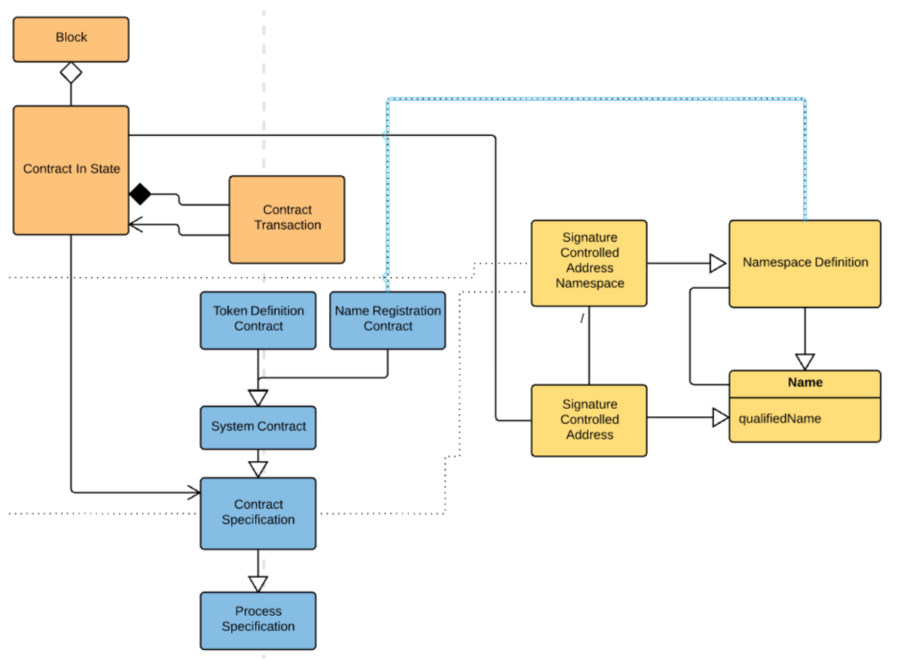

.. _contract-design:

################################################################################
Contract Design
################################################################################

An RChain contract is a well-specified, well-behaved, and formally verified program
that interacts with other well-specified, well-behaved, and formally verified programs.

Contracts are triggered by agent requests, where an agent may be a user requesting a
service through command line/GUI, or an agent may be another contract. Clients engage
with contracts via signed transactions. Contracts engage with each other via messages.

.. note::

  Alternatively, describe linear resources (contracts in which the previous state is
  input for execution) vs. non-linear resources (processes with no persistent state).

