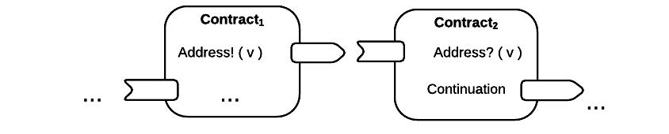
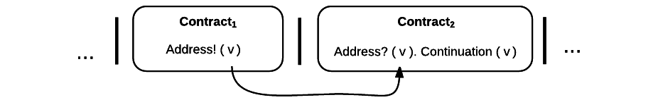
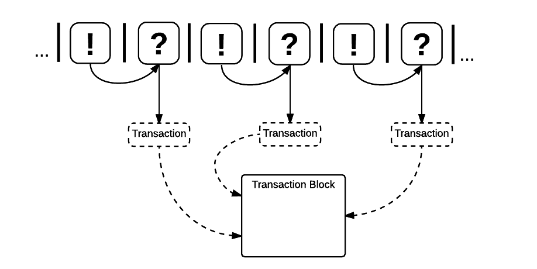

.. _contract-design:

******************************************************************
Contract Design
******************************************************************

An RChain contract is a well-specified, well-behaved, and formally verified program that interacts with other such programs.

In this section, we cover contract interaction through the production of Rholang. To begin, we give an overview of contract interaction on the RChain platform. Afterwards, we describe the core formalism RChain uses to achieve formal verification and to model concurrency on many of RChain’s system layers. Then, we explore how that core model extends to accomodate best-in-industry surface-language standards such as reflection, parallelism, asynchronicity, reactive data streams, and compile-time security-type checks.

Contract Overview
======================================================================================

Used loosely as ‘contract’, **a smart contract is a process with:**

1. Persistent state
2. Associated code
3. Associated RChain address(es)

Important to remember is that a smart contract is of arbitrary complexity. It may refer to an atomic operation or to a superset of protocols which compose to form a complex protocol.

A contract is triggered by a message from an external network agent, where an external agent may be a contract or a network user.

**A Message:**

1. Is issued over a named channel(s), which may be public or private.
2. May be typed and may range in format from a simple value to an unordered array of bytes, to a variable, to a data structure, to *the code of a process*, and most things in between.

**An Agent** sends and receives messages on named communication links known as ‘named channels’.  

**A Named Channel:**

1. Is a "location" where otherwise independent processes synchronize.
2. Is used by processes to send and receive messages between each other.
3. Is provably unguessable and anonymous unless deliberately introduced by a process.

A channel is implemented as a variable that is shared between a "read-only" and a "write-only" process. Therefore, the functionality of a channel is only limited by the interpretation of what a variable may be. As a channel represents the abstract notion of "location", it may take different forms. For our early interpretation, a named channel's function may range from the local memory address (variable) of a single machine, to the network address of a machine in a distributed system.

Consistent with that interpretation, **a blockchain address is a named channel**, i.e., a location(s) where an agent may be reached.

Two contracts sending and receiving a message on the channel named ‘Address’:

This model depicts two contracts, both of which may receive and send messages. At some point, an external actor prompts :code:`Contract1` to send a value, :code:`v`, on the channel, :code:`address`, which is the address of :code:`Contract2`. Meanwhile, :code:`Contract2` listens on the :code:`address` channel for some value :code:`v`. After it receives :code:`v`, :code:`Contract2` invokes a process continuation with :code:`v` as an argument. These last two steps occur sequentially.

Note that, this model assumes that at least the sender possesses the address of :code:`Contract2`. Also note that, after it sends :code:`v`, :code:`Contract1` has been run to termination, thus it is incapable of sending anything else unless prompted. Similarly, after it invokes its continuation, :code:`Contract2` has been run to termination, thus it is incapable of listening for any other messages.

RChain contracts enjoy fine-grain, internal concurrency, which means that these processes, and any processes that are not co-dependent, may be placed in parallel composition. So, we amend our notation:

Executing in parallel with a number of other processes, an external actor prompts :code:`Contract1` to send a value, :code:`v`, on the channel :code:`address` i.e. the address of :code:`Contract2`. If :code:`Contract1` has no value to send, it blocks. If :code:`Contract2` has not received a value, it blocks and the continuation is not triggered.

Transactions
-------------------------------------------------------------

How do transaction semantics fit into our description of contracts? **From the process level, a transaction is an acknowledgment that a message has been "witnessed" at a channel**

Messages themselves are virtual objects, but the pre-state and post-state of a contract, referring to the states before and after a message is sent by one agent and witnessed by another, are recorded and timestamped in storage, also known (in a moral sense) as the "blockchain".

Message passing is an atomic operation. Either a message is witnessed, or it is not, and only the successful witnessing of a message qualifies as a verifiable transaction that can be included in a block. Examples hitherto depict atomic protocols, but full-bodied applications may spawn, send, and receive on tens of thousands of channels at runtime. Hence, when the value of some resource is altered and witnessed by a process, there is record of when and where it was witnessed by what agent. This implementation is consistent with an interpretation of data as a linear resource.

The ability to place a message at either end of a channel before and after the message is sent, and therefore to view the serialized form of messages, is an attribute specific to RChain. Additionally, by stating successful messages as transactions, all messages, whether from external user to contract or between contracts, are accounted for. Thus, we balance the extensible autonomy of contracts with accountability.

For an example of how this model is adaptable to industry trends in reactive programming, observe the following two contracts, which model interaction over “live” data feeds:

Executing in parallel composition with a number of other processes, :code:`Contract1` is prompted to send a set of  values, :code:`vN`, on the channel :code:`address` i.e. the address of :code:`Contract2`. In this scenario, the reader will notice :code:`Contract2` as a thread which listens for a set of values as input from a single data stream that is dual to a set of values being output from a stream at its tail. When the set of values, :code:`v1...vN`, is witnessed at the channel, :code:`address`, a continuation is invoked with :code:`v1...vN` as an argument. While the interaction between :code:`Contract1` and :code:`Contract2` is asynchronous, the input operation :code:`address?(v1...vN)` and :code:`Continuation(v)` of :code:`Contract2` are necessarily sequential. :code:`address?(v1...vN)` is said to "pre-fix" :code:`Continuation(v)` in every instance.

We have presented a very basic depiction of concurrent contract interaction on the RChain platform to include contracts, recognizing addresses as channels of communication, and transactions as the successful transmission of a message over said channels. Next, we outline the core system which formally models these constructs.

The Formalism: Rho-Calculus
=================================================================

Formal verification is the *de facto* standard for many mission-critical technologies. Some of the earliest formal verification methods were applied to the two-level shutdown systems of nuclear generators [#]_. Many ATM software solutions verify performance by deriving solutions from models of linear temporal logic. Many military information and decision systems invoke Hoare logic to verify crash tolerance. An indiscriminate smart-contracting utility that desires to host mission-critical contracts bears the same responsibility of verifiability to its users. Therefore, our design approach to the surface-language and execution model is based on a provably correct model of computation [#]_.

At the same time, there are relatively few programming paradigms and languages that handle concurrent processes in their core model. Instead, they bolt some kind of threading-based concurrency model on the side to address being able to scale by doing more than one thing at a time. By contrast, the Mobile process calculi provide a fundamentally different notion of what computing is. In these models, computing arises primarily from the interaction of processes. The ability to formally verify an execution model, and to allow that execution model to be fundamentally concurrent, is why we have chosen a process calculus for RChain's model of computation.

Specifically, **the RChain execution model is derived from the syntax and semantics of rho-calculus.** The rho-calculus is a variant of the π-calculus that was introduced in 2004 to provide the first model of concurrent computation with reflection. “Rho” stands for reflective, higher-order.

Though an understanding of the π-calculus isn’t necessary for the purposes of this document, those unfamiliar with the π-calculus are strongly encouraged to explore it. The π-calculus is the first formal system to successfully model networks where nodes may regularly join and drop from the network. It assumes fine-grained concurrency and process communication i.e. two processes may be introduced by a third process. The rho-calculus extension inherits all of those features and adds reflection.

For more information, see `The Polyadic Pi-Calculus`_ and `Higher Category Models of the Pi-Calculus`_.

.. _The Polyadic Pi-Calculus: http://www.lfcs.inf.ed.ac.uk/reports/91/ECS-LFCS-91-180/
.. _Higher Category Models of the Pi-Calculus: https://arxiv.org/abs/1504.04311

Reflection
-----------------------------------------------------------------------

Reflection is now widely recognized as a key feature of practical programming languages, known broadly as "meta-programming". Reflection is a disciplined way to turn programs into data that programs can operate on and then turn the modified data back into new programs. Java, C#, and Scala eventually adopted reflection as a core feature, and even OCaml and Haskell have ultimately developed reflective versions [#]_. The reason is simple: at industrial scale, programmers use programs to write programs. Without that computational leverage, it would take too long to write advanced industrial scale programs.

Syntax and Semantics
--------------------------------------------------------------------------
The rho-calculus constructs “names” and “processes”. Similar to the π-calculus, **a name may be a channel of communication or a value. However, with the rho-calculus addition of ‘reflection’, a name may also be a ‘quoted’ process, where a quoted process is the code of a process.** The genericity of names will become important in the coming sections.

From the notion of names and processes, the calculus builds a few basic “processes”. A process may have persistent state but does not assume it. The term “process” is the more general term for “smart contract”. Hence, every contract is a process but not every process is smart contract.

Rho-calculus builds the following basic terms to describe interaction among processes:

::

  P,Q,R ::= 0                  // nil or stopped process

            |   for( ptrn1 <- x1; … ; ptrnN <- xN ).P // input guarded process
            |   x!( @Q )       // output
            |   \*x\           // dereferenced or unquoted name
            |   P|Q            // parallel composition

  x,ptrn ::= @P                // name or quoted process

The first three terms denote I/O, describing the actions of message passing:

* :code:`0` is the form of the inert or stopped process that is the ground of the
  model.

* The input term, :code:`for( ptrn1 <- x1; … ; ptrnN <- xN )P`, is the form of an
  input-guarded process, :code:`P`, listening for a set of patterns, :code:`ptrnN`,
  on a set of channels, :code:`xN`. On receiving such a pattern, continuation P
  is invoked [#]_. Scala programmers will notice the 'for-comprehension' as
  syntactic sugar for treating channel access monadically [#]_. The result is
  that all input-channels are subject to pattern matching, which constructs an
  input-guard of sorts.

* The output term, :code:`x!( @Q )`, sends the name, :code:`@Q`, on channel, :code:`x`. Although the name being sent on :code:`x` may be a values, a channel, or a quoted process (which may itself contain many channels and values), our notation uses, :code:`@Q` to reiterate the expressiveness of names.

The next term is structural, describing concurrency:

* :code:`P|Q` is the form of a process that is the parallel composition of two processes P and Q where both processes are executing and communicating asynchronously.

Two additional terms are introduced to provide reflection:

* :code:`@P` , the “Reflect" term introduces the notion of a “quoted process”, which is the code of a process that is serialized and sent over a channel.

* :code:`x` , the “Reify” term, allows a quoted process to be deserialized from a channel.

This syntax gives the basic term language that will comprise the Rholang  type system primitives.
The rho-calculus assumes internal structure on names, which  is preserved as they’re passed between processes. One result of being able to investigate the internal structure of a name is that processes may be serialized to a channel and then deserialized upon being received, which means that processes may not only communicate signals to one another, they may communicate full-form processes to one another. Hence, the higher-order extension.

Rho-calculus also gives a single, reduction (substitution) rule to realize computation, known as the “COMM” rule. Reductions are atomic; they either happen, or they don’t. It is the only rule which directly reduces a rho-calculus term:

.. code-block:: none

  for( ptrn <- x ).P | x!(@Q) -> P{ @Q/ptrn } //Reduction Rule

The COMM rule requires that two processes are placed in concurrent execution. It also requires that the two are in a co-channel relationship. That is, one process is reading from channel, :code:`x`, while the other process is writing to the channel, :code:`x`. The two processes are said to "synchronize" at :code:`x`. The output process sends the quoted process, :code:`@Q`, on :code:`x`. In parallel, the input process waits for an arbitrary pattern, :code:`ptrn` to arrive on :code:`x`. Upon matching the pattern, it executes continuation :code:`P`. After reduction, the simplified term denotes :code:`P`, which will execute in an environment where :code:`@Q` is bound to :code:`ptrn`. That is, :code:`@Q` is substituted for every occurrence of the :code:`ptrn`,  in the body of :code:`P`.

The COMM rule implies the successful communication of a message over a channel. The reader may remember that successful communication of a message over a channel constitutes a verifiable transaction. In fact, **a reduction is a transaction** precisely because it verifies that a resource has been accessed and altered. As a result, **the number of reductions performed corresponds to the units of atomic computation performed, which are fundamentally tethered to the number of transactions committed to a block.** This correspondence ensures that all platform computation is indiscriminately quantifiable.

Another implication of being able to investigate the internal structure of a name is that channels may encapsulate yet more channels. Though they are very light in an atomic sense, when channels possess internal structure, they may function as data stores, data structures, and provably unbounded queues of arbitrary depth. In fact, in almost all implementations, a contract’s persistent storage will consist of state value stored in a :code:`state` channel which takes requests to :code:`set` and :code:`get` a :code:`newValue`. We will demonstrate the wide-sweeping implications of internal structure on channels in the section on namespaces. For further details, see `A Reflective Higher-Order Calculus`_ and `Namespace Logic - A Logic for a Reflective Higher-Order Calculus`_.

.. _A Reflective Higher-Order Calculus: http://www.sciencedirect.com/science/article/pii/S1571066105051893
.. _Namespace Logic - A Logic for a Reflective Higher-Order Calculus: http://citeseerx.ist.psu.edu/viewdoc/summary?doi=10.1.1.95.9601

Behavioral Types
----------------------------------------------------

A behavioral type is a property of an object that binds it to a discrete range of action patterns. Behavioral types constrain not only the structure of input and output, but **the permitted order of inputs and outputs among communicating and (possibly) concurrent processes under varying conditions.**

Behavioral types are specific to the mobile process calculi particularly because of the non-determinism the mobile calculi introduce and accommodate. More specifically, a concurrent model may introduce multiple scenarios under which data may be accessed, yet possess no knowledge as to the sequence in which those scenarios occur. Data may be shareable at a certain stage of a protocol but not in a subsequent stage. In that sense, resource competition is problematic; if a system does not respect precise sharing constraints on objects, mutations may result. Therefore we require that network resources are used according to a strict discipline which describes and specifies sets of processes that demonstrate a similar, “safe” behavior.

The Rholang behavioral type system will iteratively decorate terms with modal logical operators, which are propositions about the behavior of those terms. Ultimately properties data information flow, resource access, will be concretized in a type system that can be checked at compile-time.

The behavioral type systems Rholang will support make it possible to evaluate collections of contracts against how their code is shaped and how it behaves. As such, Rholang contracts elevate semantics to a type-level vantage point, where we are able to scope how entire protocols can safely interface.

In their seminal paper, `Logic as a Distributive Law`_, Mike Stay & Gregory Meredith, develop an algorithm to iteratively generate a spatial-behavioral logic from any monadic data structure.

.. _Logic as a Distributive Law: https://arxiv.org/pdf/1610.02247v3.pdf

Significance
=================================================

This model has been peer reviewed multiple times over the last ten years. Prototypes demonstrating its soundness have been available for nearly a decade. The minimal rho-calculus syntax expresses six primitives - far fewer than found in Solidity, Ethereum’s smart contracting language, yet the model is far more expressive than Solidity. In particular, Solidity-based smart contracts do not enjoy internal concurrency, while Rholang-based contracts assume it.

To summarize, the rho-calculus formalism is the first computational model to:

1. Realize maximal code mobility via ‘reflection’, which permits full-form, quoted processes to be passed as first-class-citizens to other network processes.

2. Lend a framework to mathematically verify the behavior of reflective, communicating processes and fundamentally concurrent systems of dynamic network topology.

3. Denote a fully scalable design which naturally accommodates industry trends in structural pattern matching, process continuation, Reactive API’s, parallelism, asynchronicity, and behavioral types.

RhoLang - A Concurrent Language
=========================================================

Rholang is a fully featured, general purpose, Turing-complete programming
language built from the rho-calculus. It is a behaviorally typed, **r**-eflective,
**h**-igher **o**-rder process language and the official smart contracting language
of RChain. Its purpose is to concretize fine-grained, programmatic concurrency.

Necessarily, the language is concurrency-oriented, with a focus on message-passing through input-guarded channels. Channels are statically typed and can be used as single message-pipes, streams, or data stores. Similar to typed functional languages, Rholang will support immutable data structures.

To get a taste of Rholang, here’s a contract named :code:`Cell` that holds a value and allows clients to get and set it:

.. code-block:: none

   contract Cell( get, set, state ) = {
     select {
       case rtn <- get; v <- state => {
         rtn!( *v ) | state!( *v ) | Cell( get, set, state )
       }

       case newValue <- set; v <- state => {
         state!( *newValue ) | Cell( get, set, state )
       }
     }
   }

This contract takes a channel for :code:`get` requests, a channel for :code:`set` requests, and a :code:`state` channel where we will hold a data resource. It waits on the :code:`get` and :code:`set` channels for client requests. Client requests are pattern matched via :code:`case` classes [#]_.

Upon receiving a request, the contract joins :code:`;` an incoming client with a request against the :code:`state` channel. This join does two things. Firstly, it removes the internal :code:`state` from access while this, in turn, sequentializes :code:`get` and :code:`set` actions, so that they are always operating against a single consistent copy of the resource - simultaneously providing a data resource synchronization mechanism and a memory of accesses and updates against the :code:`state`.

In the case of :code:`get`, a request comes in with a :code:`rtn` address where the value, :code:`v`, in :code:`state` will be sent. Since :code:`v` has been taken from the :code:`state` channel, it is put back, and the :code:`Cell` behavior is recursively invoked.

In the case of :code:`set`, a request comes in with a :code:`newValue`, which is published to the :code:`state` channel (the old value having been stolen by the join). Meanwhile, the :code:`Cell` behavior is recursively invoked.

Confirmed by :code:`select`, only one of the threads in :code:`Cell` can respond to the client request. It’s a race, and the losing thread, be it getter or setter, is killed. This way, when the recursive invocation of :code:`Cell` is called, the losing thread is not hanging around, yet the new :code:`Cell` process is still able to respond to either type of client request.

For a more complete historical narrative leading up to Rholang, see `Mobile Process Calculi for Programming the Blockchain`_.

.. _Mobile Process Calculi for Programming the Blockchain: https://docs.google.com/document/d/1lAbB_ssUvUkJ1D6_16WEp4FzsH0poEqZYCi-FBKanuY

.. [#] Lawford, M., Wassyng, A.: Formal Verification of Nuclear Systems: Past, Present, and Future. Information & Security: An International Journal. 28, 223–235 (2012).
.. [#] In addition to selecting a formally verifiable model of computation,  are investigating a few verification frameworks such as the `K-Framework`_ to achieve this. 
.. _K-Framework: http://www.kframework.org/index.php/Main_Page
.. [#] See Scala Documentation: Reflection
.. [#] See Scala Documentation: For-Comprehensions
.. [#] See Scala Documentation: Delimited Continuations
.. [#] See Scala Documentation: Case Classes
