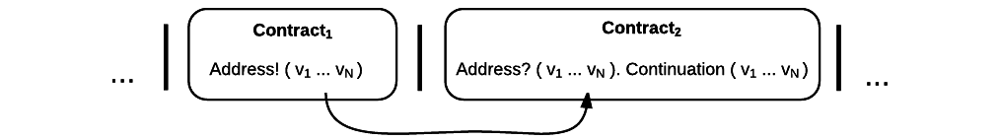

.. _contract-design:

******************************************************************
Contract Design
******************************************************************

In this section on contract design, we investigate how RChain achieves internal concurrency for smart contracts. To begin, we give an overview of contract interaction. Afterwards, we describe the core formalism RChain uses to achieve concurrency and formal verification of contracts. Throughout, we demonstrate how that model extends to accomodate best-in-industry language attributes such as reflection, parallelism, asynchronicity, reactive API's, and compile-time security-type checks.

Contract Overview
======================================================================================

Likewise, a channel is implemented as a variable that is shared between two divided "read-only" and a "write-only" process, so the functional range of a channel is only limited to what a variable may represent. A channel may be  local variable, a global varible, a location in a datastore, or the network address (TCP/IP Sockets) of a machine in a distributed system.

Two contracts sending and receiving a message on the channel named ‘Address’:

.. figure:: ../img/57444266.png
   :height: 170
   :width: 844
   :align: center
   :scale: 80

This model depicts two contracts, both of which may receive and send messages. At some point, an external actor prompts :code:`Contract1` to send a value, :code:`v`, on the channel, :code:`address`, which is the address of :code:`Contract2`. Meanwhile, :code:`Contract2` listens on the :code:`address` channel for some value :code:`v`. After it receives :code:`v`, :code:`Contract2` invokes a process continuation with :code:`v` as an argument. These last two steps occur sequentially.

Note, this model assumes that at least the sender possesses the address of :code:`Contract2`. Note also, after it sends :code:`v`, :code:`Contract1`, has been run to termination. Thus, it is incapable of sending anything else unless prompted. Similarly, after it invokes its continuation, :code:`Contract2` has been run to termination, and it is incapable of receiving further messages.

RChain contracts enjoy internal concurrency, which means that these processes, and any processes that are not co-dependent, may be placed in parallel composition. So, we amend our notation:

.. figure:: ../img/82846984.png
   :align: center
   :width: 926
   :height: 124
   :scale: 80

Executing in parallel with a number of other processes, an external actor prompts :code:`Contract1` to send a value, :code:`v`, on the channel :code:`address` i.e. the address of :code:`Contract2`. If :code:`Contract1` has no value to send, it blocks. If :code:`Contract2` has not received a value, it blocks and the continuation is not triggered.

For an example of how this model is adaptable to industry trends in reactive programming, observe the following two contracts, which interact over live data feeds:

:code:`Contract1` is prompted to send a set of  values, :code:`vN`, on the channel :code:`address` i.e. the address of :code:`Contract2`. In this scenario, :code:`Contract2` is like a thread. It recieves a set of values from the head of a stream that is dual to a set of values being produced at its tail. When the set of values, :code:`v1...vN`, is witnessed at the channel, :code:`address`, a continuation is invoked with :code:`v1...vN` as an argument. While the interaction between :code:`Contract1` and :code:`Contract2` is asynchronous, the input operation :code:`address?(v1...vN)` and :code:`Continuation(v)` of :code:`Contract2` are necessarily sequential. :code:`address?(v1...vN)` is said to "pre-fix" :code:`Continuation(v)` in every execution instance.

We have presented a high-level depiction of contract interaction on the RChain platform. Next, we outline the formal method which derives these interactions.

Rho-calculus: A Concurrent Model of Computation for the Blockchain
===================================================================

Despite the growing body of knowledge in support of concurrency, there are relatively few programming languages that address concurrent processing in their core model. *Concurrency is a structural property that allows processes to execute with maximal order-independence*. Having said that, RChain admits the inevitable and non-trivial computational overhead of a consensus mechanism by nature of using blockchain technology. With the consensus overhead in mind, RChain chose the **rho-calculus** model of concurrent computation.

The rho-calculus is one constitutent of a mucher larger class of formal systems known as the **process calculi**. It was introduced as a variant of the **π-calculus** in 2004 by Greg Meredith. Like the π-calculus, the rho-calculus is a programming abstraction based on message passing between processes. However, the rho-calculus is distinguished from the π-calculus because it supports "reflection". “Rho-calculus” stands for reflective, higher-order calculus.

For more information, see `The Polyadic Pi-Calculus`_ and `Higher Category Models of the Pi-Calculus`_.

.. _The Polyadic Pi-Calculus: http://www.lfcs.inf.ed.ac.uk/reports/91/ECS-LFCS-91-180/
.. _Higher Category Models of the Pi-Calculus: https://arxiv.org/abs/1504.04311

Reflection is widely recognized as a key feature of practical programming languages. Known broadly as "meta-programming", reflection is a disciplined way to turn programs into data that programs can operate on and then turn the modified data back into new programs. Java, C#, and Scala eventually adopted reflection as a core feature, and even OCaml and Haskell have ultimately developed reflective versions [#]_. The reason is simple: at industrial scale, programmers use programs to write programs. Without that computational leverage, it would take too long to write advanced industrial scale programs.

Preamble: Basic Constructs
--------------------------------------------------------------------------

Before we make the case for why the rho-calculus model of concurrent computation will beget the scalable blockchain, we introduce core concepts that are mostly consistent with message-passing paradigms, with a few very useful outliers. The rho-calculus constructs *processes* and *channels*. Independent processes may *only* interact by passing messages over channels.

We can think of **a process as an abstraction of an independent thread of control.** A process is of arbitrary complexity; it may refer to an atomic operation or to a superset of protocols. A process can be stateful but does not assume persistent state and can therefore be thought of as the more general form of a “smart contract”, which is necessarily stateful[#]_. Hence, every smart contract is a process, but not every process is a smart contract.

.. [#] The coming sections will describe smart contracts as processes with persistent state, consistent with an interpretation of values as linear resources.

**A channel is an abstraction of a communication link between two processes** that:

1. Has an associated name (identifier).
2. Is statically typed; and
3. Is provably unguessable and anonymous unless deliberately given by a process.

Processes interact by sending and receiving messages. A message:

1. Is passed over a channel; and
2. May be a simple value, *a channel itself*, a data structure, or *the code of a process*.

Formal Syntax
---------------------------------------------------

The rho-calculus presents the following syntax, where :code:`P` and :code:`Q` are processes. These basic terms also happen to be the primitives for RChain's contracting language:

::

  P,Q ::=   0                  // nil or stopped process

            |   x!( @Q )       // output ("bang")
            |   for( ptrn <- x).P // input-guarded process
            |   *x             // evaluate
            |   P|Q            // parallel composition

  x,ptrn ::= @P                // quoted process

Each of the above terms are processes. The first three terms denote I/O, describing the actions of message passing:

* :code:`0` is the stop/halt process that is the ground of the model.

* The output process, :code:`x!( @Q )`, sends :code:`@Q` on the channel, :code:`x`. 

In this representation, :code:`@Q`, is the quoted process :code:`Q`, but any value, simple or complex, can be sent as a message, including a channel itself.

* The input process, :code:`for( ptrn <- x ).P`, searches for a defined pattern, :code:`ptrn`, on the channel :code:`x`. On matching that pattern, it invokes the continuation, :code:`P`[#]_. Note that, this is the only term which defines a subsequent computation.The rho-calculus has a unique implementation of the input term that is improved from traditional representations of the π-calculus input term in two respects:

   1. A channel corresponds to an unbounded and persistent queue that is structured monadically[#]_. In simple terms, a channel is like    a container that holds a range of values. The for-comprehension allows us to search that range for values that match a pre-defined        pattern. It is effectively an input-guard which stipulates that some state must be observed at :code:`x` before the continuation          :code:`P` is triggered. The input term can be decorated with additional language constructs, such as if-conditionals, to refine query results.

   2. At runtime, input operations search for data on channels while output operations place data at channels, and channels may be bound    to a number of live data generators. Thus, the input process supports the same data streaming capabilities that have made the reactive      paradigm so popular. This imbues process interaction, written in Rholang, with exceptional responsiveness.

The next term is structural, describing concurrency:

* :code:`P|Q` is the form of a process that is the parallel composition of two processes, :code:`P` and :code:`Q`.

Two additional terms are introduced to provide reflection:

* :code:`@`, the “Reflect" operation serializes or "quotes" the code of a process. This allows us to send processes to other processes.

* :code:`*`, the “Reify” operation deserializes or "unquotes" and evaluates the code of a process.

It goes without saying that abstraction is a powerful tool for managing complexity. The above presentation is sufficiently abstract to allow the implementations of processes, channels, and messages to go largely undefined. For that reason, the rho-calculus model is our most efficient tool to reason about concurrency on a variety of architectural layers, from stack-level evaluation to network-level inter-node communication.

Use-cases
-------------------------------------------------------

Because for-comprehensions also supports join semantics, we can stipulate pattern matches on multiple channels: :code:`for( pThis introduces something of a transactional guarantee 

For example, if for some reason, we were traversing the store for all contracts similar to a contract :code:`@Q`, we could implement a naive input process, :code:`for ( @Q <- x ). P`, which filters through the data at, :code:`x`, to find a contract structurally equivalent to :code:`@Q` and then performs some computation, :code:`P`, on that result.

Rho-calculus also gives a single, reduction (substitution) rule to realize computation, known as the “COMM” rule. Reductions are atomic; they either happen, or they don’t. It is the only rule which directly reduces a rho-calculus term:

.. code-block:: none

  for( ptrn <- x ).P | x!(@Q) -> P{ @Q/ptrn } //Reduction Rule

The COMM rule requires that two processes are placed in concurrent execution. It also requires that the two are in a co-channel relationship. That is, one process is reading from channel, :code:`x`, while the other process is writing to the channel, :code:`x`. The two processes are said to "synchronize" at :code:`x`. The output process sends the quoted process, :code:`@Q`, on :code:`x`. In parallel, the input process waits for an arbitrary pattern, :code:`ptrn` to arrive on :code:`x`. Upon matching the pattern, it executes continuation :code:`P`. After reduction, the simplified term denotes :code:`P`, which will execute in an environment where :code:`@Q` is bound to :code:`ptrn`. That is, :code:`@Q` is substituted for every occurrence of the :code:`ptrn`,  in the body of :code:`P`.

The COMM rule implies the successful communication of a message over a channel. The reader may remember that successful communication of a message over a channel constitutes a verifiable transaction. In fact, **a reduction is a transaction** precisely because it verifies that a resource has been accessed and altered. As a result, **the number of reductions performed corresponds to the units of atomic computation performed, which are fundamentally tethered to the number of transactions committed to a block.** This correspondence ensures that all platform computation is indiscriminately quantifiable.

Another implication of being able to investigate the internal structure of a name is that channels may encapsulate yet more channels. Though they are very light in an atomic sense, when channels possess internal structure, they may function as data stores, data structures, and provably unbounded queues of arbitrary depth. In fact, in almost all implementations, a contract’s persistent storage will consist of state value stored in a :code:`state` channel which takes requests to :code:`set` and :code:`get` a :code:`newValue`. We will demonstrate the wide-sweeping implications of internal structure on channels in the section on namespaces. For further details, see `A Reflective Higher-Order Calculus`_ and `Namespace Logic - A Logic for a Reflective Higher-Order Calculus`_.

.. _A Reflective Higher-Order Calculus: http://www.sciencedirect.com/science/article/pii/S1571066105051893
.. _Namespace Logic - A Logic for a Reflective Higher-Order Calculus: http://citeseerx.ist.psu.edu/viewdoc/summary?doi=10.1.1.95.9601

Behavioral Types
----------------------------------------------------

A behavioral type is a property of an object that binds it to a discrete range of action patterns. Behavioral types constrain not only the structure of input and output, but **the permitted order of inputs and outputs among communicating and (possibly) concurrent processes under varying conditions.**

Behavioral types are specific to the mobile process calculi particularly because of the non-determinism the mobile calculi introduce and accommodate. More specifically, a concurrent model may introduce multiple scenarios under which data may be accessed, yet possess no knowledge as to the sequence in which those scenarios occur. Data may be shareable at a certain stage of a protocol but not in a subsequent stage. In that sense, resource competition is problematic; if a system does not respect precise sharing constraints on objects, mutations may result. Therefore we require that network resources are used according to a strict discipline which describes and specifies sets of processes that demonstrate a similar, “safe” behavior.

The Rholang behavioral type system will iteratively decorate terms with modal logical operators, which are propositions about the behavior of those terms. Ultimately properties data information flow, resource access, will be concretized in a type system that can be checked at compile-time.

The behavioral type systems Rholang will support make it possible to evaluate collections of contracts against how their code is shaped and how it behaves. As such, Rholang contracts elevate semantics to a type-level vantage point, where we are able to scope how entire protocols can safely interface.

In their seminal paper, `Logic as a Distributive Law`_, Mike Stay & Gregory Meredith, develop an algorithm to iteratively generate a spatial-behavioral logic from any monadic data structure.

.. _Logic as a Distributive Law: https://arxiv.org/pdf/1610.02247v3.pdf

Significance
=================================================

This model has been peer reviewed multiple times over the last ten years. Prototypes demonstrating its soundness have been available for nearly a decade. The minimal rho-calculus syntax expresses six primitives - far fewer than found in Solidity, Ethereum’s smart contracting language, yet the model is far more expressive than Solidity. In particular, Solidity-based smart contracts do not enjoy internal concurrency, while Rholang-based contracts assume it.

To summarize, the rho-calculus formalism is the first computational model to:

1. Realize maximal code mobility via ‘reflection’, which permits full-form, quoted processes to be passed as first-class-citizens to other network processes.

2. Lend a framework to mathematically verify the behavior of reflective, communicating processes and fundamentally concurrent systems of dynamic network topology.

3. Denote a fully scalable design which naturally accommodates industry trends in structural pattern matching, process continuation, Reactive API’s, parallelism, asynchronicity, and behavioral types.

RhoLang - A Concurrent Blockchain Language
=========================================================

Rholang is a fully featured, general purpose, Turing complete programming
language built from the rho-calculus. It is a behaviorally typed, **r**-eflective,
**h**-igher **o**-rder process language and the official smart contracting language
of RChain. Its purpose is to concretize fine-grained, programmatic concurrency.

Necessarily, the language is concurrency-oriented, with a focus on message-passing through input-guarded channels. Channels are statically typed and can be used as single message-pipes, streams, or data stores. Similar to typed functional languages, Rholang will support immutable data structures.

To get a taste of Rholang, here’s a contract named :code:`Cell` that holds a value and allows clients to get and set it:

.. code-block:: none

   contract Cell( get, set, state ) = {
     select {
       case rtn <- get; v <- state => {
         rtn!( *v ) | state!( *v ) | Cell( get, set, state )
       }

       case newValue <- set; v <- state => {
         state!( *newValue ) | Cell( get, set, state )
       }
     }
   }

This contract takes a channel for :code:`get` requests, a channel for :code:`set` requests, and a :code:`state` channel where we will hold a the data resource. It waits on the :code:`get` and :code:`set` channels for client requests. Client requests are pattern matched via :code:`case` class [#]_.

Upon receiving a request, the contract joins :code:`;` an incoming client with a request against the :code:`state` channel. This join does two things. Firstly, it removes the internal :code:`state` from access while this, in turn, sequentializes :code:`get` and :code:`set` actions, so that they are always operating against a single consistent copy of the resource - simultaneously providing a data resource synchronization mechanism and a memory of accesses and updates against the :code:`state`.

In the case of :code:`get`, a request comes in with a :code:`rtn` address where the value, :code:`v`, in :code:`state` will be sent. Since :code:`v` has been taken from the :code:`state` channel, it is put back, and the :code:`Cell` behavior is recursively invoked.

In the case of :code:`set`, a request comes in with a :code:`newValue`, which is published to the :code:`state` channel (the old value having been stolen by the join). Meanwhile, the :code:`Cell` behavior is recursively invoked.

Confirmed by :code:`select`, only one of the threads in :code:`Cell` can respond to the client request. It’s a race, and the losing thread, be it getter or setter, is killed. This way, when the recursive invocation of :code:`Cell` is called, the losing thread is not hanging around, yet the new :code:`Cell` process is still able to respond to either type of client request.

For a more complete historical narrative leading up to Rholang, see `Mobile Process Calculi for Programming the Blockchain`_.

.. _Mobile Process Calculi for Programming the Blockchain: https://docs.google.com/document/d/1lAbB_ssUvUkJ1D6_16WEp4FzsH0poEqZYCi-FBKanuY

.. [#] Lawford, M., Wassyng, A.: Formal Verification of Nuclear Systems: Past, Present, and Future. Information & Security: An International Journal. 28, 223–235 (2012).
.. [#] In addition to selecting a formally verifiable model of computation,  are investigating a few verification frameworks such as the `K-Framework`_ to achieve this. 
.. _K-Framework: http://www.kframework.org/index.php/Main_Page
.. [#] See Scala Documentation: Reflection
.. [#] See Scala Documentation: For-Comprehensions
.. [#] See Scala Documentation: Delimited Continuations
.. [#] See Scala Documentation: Case Classes
