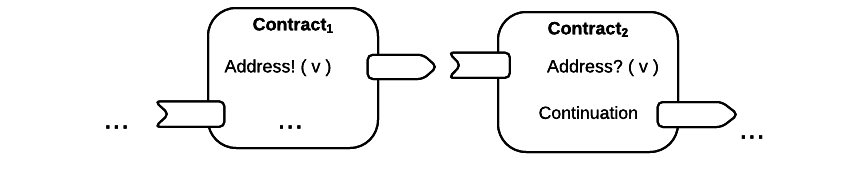
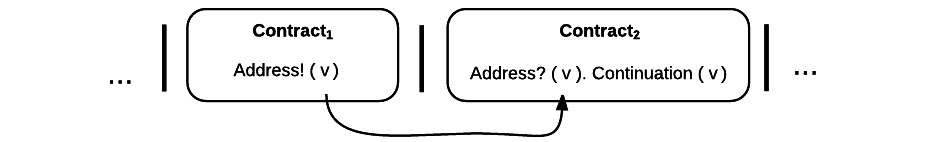
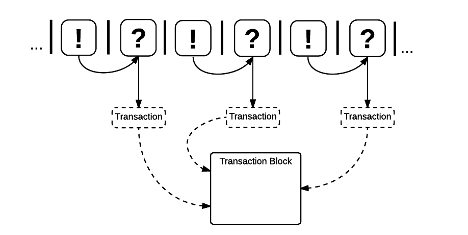

.. _contract-design:

******************************************************************
Design del contratto
******************************************************************

Un contratto Rchain è un programma ben specificato, con un buon comportamento e formalmente verificato che interagisce con altri programmi di questo tipo.

In questa sezione, affrontiamo l'interazione del contratto attraverso la produzione di Rholang. Per iniziare, diamo una panoramica dell'interazione del contratto sulla piattaforma Rchain. Successivamente, descriviamo il formalismo di base che Rchain utilizza per ottenere una verifica formale e per modellare la concorrenza su molti livelli del sistema di Rchain. Quindi, esploriamo come questo modello di base si estende per soddisfare gli standard migliori del settore nei termini della superficie come la riflessione, il parallelismo, l'asincronicità, i flussi di dati reattivi e i controlli dei tempi di compilazione di sicurezza.

Panoramica del contratto
======================================================================================

Usato genericamente come ‘contract’, **un contratto intelligente è un processo con:**

1. Stato persistente
2. Codice associato
3. indirizzo (i) Rchain associato (i)

È importante ricordare che un contratto intelligente è di una complessità arbitraria. Può riferirsi a un'operazione atomica o a un superset di protocolli che si compongono per formare un protocollo complesso.

Un contratto viene attivato da un messaggio da un agente di rete esterno, il quale agente esterno può essere un contratto o un utente di rete.

**Un messaggio:**

1. È rilasciato su uno o più canali denominati, che possono essere pubblici o privati.
2. Può essere digitato e può variare nel formato, da un semplice valore a una serie non ordinata di byte, a una variabile, a una struttura dati, al *codice di un processo*, e alla maggior parte delle cose che si trovano in mezzo.

**Un agente** invia e riceve messaggi su collegamenti di comunicazione denominati, noti come ‘named channels’.  

**Un canale denominato:**

1. È una "posizione" in cui sincronizzare processi altrimenti indipendenti.
2. Viene utilizzato dai processi per inviare e ricevere messaggi tra loro.
3. È indisputabilmente indecifrabile e anonimo se non deliberatamente introdotto da un processo.

Un canale è implementato come una variabile condivisa tra un processo di "sola lettura" e un processo di "sola scrittura". Pertanto, la funzionalità di un canale è limitata solo dall'interpretazione di cosa può essere una variabile. Poiché un canale rappresenta la nozione astratta di "posizione", può assumere forme diverse. Per la nostra interpretazione anticipata, la funzione di un canale denominato può variare dall'indirizzo di memoria locale (variabile) di un singolo elaboratore, all'indirizzo di rete di un elaboratore in un sistema distribuito.

Coerentemente con tale interpretazione, **un indirizzo blockchain è un canale denominato**, i.e., cioè, una o più posizioni in cui un agente può essere raggiunto.

Due contratti di invio e ricezione di un messaggio sul canale denominato ‘Address’:

Questo modello descrive due contratti, i quali possono entrambi ricevere e inviare messaggi. Ad un certo punto, un attore esterno richiede :code:`Contract1` per inviare un valore, :code:`v`, sul canale, :code:`address`, che è l'indirizzo di :code:`Contract2`. Nel frattempo, :code:`Contract2` ascolta sul canale :code:`address` per qualche valore :code:`v`. Dopo aver ricevuto :code:`v`, :code:`Contract2` invoca una continuazione del processo con :code:`v` come argomento. Questi ultimi due passaggi si verificano in sequenza.

Si noti che questo modello presuppone che almeno il mittente possieda l'indirizzo di :code:`Contract2`. Si noti inoltre che, dopo aver inviato :code:`v`, :code:`Contract1` è stato eseguito alla chiusura, quindi non è in grado di inviare altro a meno che non venga richiesto. Allo stesso modo, dopo aver invocato la sua continuazione, :code:`Contract2` è stato eseguito fino alla terminazione, quindi non è in grado di ascoltare altri messaggi.

I contratti Rchain godono di una concorrenza interna fine-grained, il che significa che questi processi e tutti i processi che non sono co-dipendenti possono essere collocati in una composizione parallela. Quindi, correggiamo la nostra notazione:

Eseguendo in parallelo un numero di altri processi, un attore esterno richiede :code:`Contract1` per inviare un valore, :code:`v`, sul canale :code:`address` cioè l'indirizzo di :code:`Contract2`. Se :code:`Contract1` non ha valore da inviare, si blocca. Se :code:`Contract2` non ha ricevuto un valore, si blocca e la continuazione non viene attivata.

Le transazioni
-------------------------------------------------------------

In che modo la semantica delle transazioni si adatta alla nostra descrizione dei contratti? **A livello di processo, una transazione è un riconoscimento che un messaggio è stato "visto" su un canale**

I messaggi stessi sono oggetti virtuali, ma il pre-stato e lo stato successivo di un contratto, che fa riferimento agli stati prima e dopo che un messaggio è stato inviato da un agente e assistito da un altro, sono registrati e marcati con data e ora nello spazio di archiviazione, anche noti (in senso morale) come "blockchain".

Il passaggio dei messaggi è un'operazione atomica. O un messaggio è testimoniato, o non lo è, e solo la testimonianza di successo di un messaggio si qualifica come una transazione verificabile che può essere inclusa in un blocco. Gli esempi riportati finora descrivono i protocolli atomici, ma le applicazioni corpose possono generare, inviare e ricevere decine di migliaia di canali in fase di runtime. Quindi, quando il valore di alcune risorse viene alterato e assistito da un processo, vi è la registrazione di quando e dove è stato visto e da quale agente. Questa implementazione è coerente con un'interpretazione dei dati come risorsa lineare.

La possibilità di inserire un messaggio alle due estremità di un canale prima e dopo che il messaggio è stato inviato, e quindi di visualizzare la forma serializzata dei messaggi, è un attributo specifico per Rchain. Inoltre, affermando i messaggi di successo come transazioni, vengono contabilizzati tutti i messaggi, sia da utente esterno a contratto che tra contratti. Pertanto, bilanciamo l'autonomia estensibile dei contratti con la rendicontazione.

Per un esempio di come questo modello è adattabile alle tendenze del settore nella programmazione reattiva, si osservino i seguenti due contratti, che modellano l'interazione sui feed di dati “live”:

.. figure:: ../img/21300107.png
   :width: 1014
   :height: 142
   :align: center
   :scale: 50

Eseguendo in composizione parallela con un numero di altri processi, al, :code:`Contract1` viene richiesto di inviare un insieme di valori, :code:`vN`, sul canale :code:`address` cioè l'indirizzo di :code:`Contract2`. In questo scenario, il lettore noterà :code:`Contract2` come thread che ascolta un set di valori come input da un singolo flusso di dati che è duplice a un insieme di valori che vengono emessi da un flusso alla sua coda. Quando il set di valori, :code:`v1...vN`, è visto sul canale, :code:`address`, una continuazione viene invocata con :code:`v1...vN` come argomento. Mentre l'interazione tra :code:`Contract1` e :code:`Contract2` è asincrona, l'operazione di input :code:`address?(v1...vN)` e :code:`Continuation(v)` of :code:`Contract2` are necessarily sequential. :code:`address?(v1...vN)` è detto a "prefissare" :code:`Continuation(v)` in ogni istanza.

Abbiamo presentato una rappresentazione molto basilare dell'interazione di contratti simultanei sulla piattaforma Rchain per includere i contratti, riconoscere gli indirizzi come canali di comunicazione e le transazioni come trasmissione riuscita di un messaggio su detti canali. Successivamente, delineiamo il sistema centrale che modella formalmente questi costrutti.

Il formalismo: Rho-Calculus
=================================================================

La verifica formale è lo standard *de facto* per molte tecnologie mission-critical. Alcuni dei primi metodi di verifica formale sono stati applicati ai sistemi di spegnimento a due livelli dei generatori nucleari [#]_. Molte soluzioni software ATM verificano le prestazioni derivando soluzioni da modelli di logica temporale lineare. Molte informazioni militari e sistemi decisionali invocano la logica di Hoare per verificare la tolleranza d’arresto. Un'utilità di contrattazione intelligente indiscriminata che desidera ospitare contratti mission-critical ha la stessa responsabilità di verificabilità per i propri utenti. Pertanto, il nostro approccio progettuale al linguaggio di superficie e al modello di esecuzione si basa su un modello di calcolo indisputabilmente corretto. [#]_.

Allo stesso tempo, ci sono relativamente pochi paradigmi e linguaggi di programmazione che gestiscono processi concorrenti nel loro modello di base. Invece, chiudono a parte una sorta di modello di concorrenza basato su threading per affrontare la possibilità di espandersi facendo più di una cosa alla volta. Al contrario, i calcoli del processo mobile forniscono una nozione fondamentalmente diversa di ciò che è l'informatica. In questi modelli, il calcolo deriva principalmente dall'interazione dei processi. La possibilità di verificare formalmente un modello esecutivo e di consentire a tale modello di esecuzione di essere fondamentalmente concomitante, è il motivo per cui abbiamo scelto un calcolo del processo per il modello di calcolo di Rchain.

Nello specifico, **il modello di esecuzione di Rchain deriva dalla sintassi e dalla semantica del rho-calculus.** Il rho-calculus è una variante del calcolo π che è stato introdotto nel 2004 per fornire il primo modello di calcolo simultaneo con riflessione. “Rho” sta per riflettente, di ordine superiore.

Sebbene la comprensione del calcolo π non sia necessaria ai fini di questo documento, coloro che non hanno familiarità con il calcolo π sono fortemente incoraggiati ad esplorarlo. Il calcolo π è il primo sistema formale a modellare con successo reti in cui i nodi possono regolarmente aderire e rilasciare la rete. Assume la concorrenza fine-grained e la comunicazione di processo, cioè due processi possono essere introdotti da un terzo processo. L'estensione rho-calculus eredita tutte queste funzionalità e aggiunge la riflessione.

Per ulteriori informazioni, vedere `The Polyadic Pi-Calculus`_ e `Higher Category Models of the Pi-Calculus`_.

.. _The Polyadic Pi-Calculus: http://www.lfcs.inf.ed.ac.uk/reports/91/ECS-LFCS-91-180/
.. _Higher Category Models of the Pi-Calculus: https://arxiv.org/abs/1504.04311

Riflessione
-----------------------------------------------------------------------

La riflessione è ora ampiamente riconosciuta come una caratteristica chiave dei linguaggi di programmazione pratica, noti in generale come "meta-programmazione". La riflessione è un modo disciplinato per trasformare i programmi in dati su cui i programmi possono operare e quindi trasformare i dati modificati in nuovi programmi. Java, C# e Scala infine hanno adottato la riflessione come caratteristica fondamentale, e persino OCaml e Haskell hanno in definitiva sviluppato versioni riflettenti [#]_. La ragione è semplice: su scala industriale, i programmatori usano programmi per scrivere programmi. Senza quella leva computazionale, ci vorrebbe troppo tempo per scrivere programmi avanzati su scala industriale.

Sintassi e semantica
--------------------------------------------------------------------------
Il rho-calcolus costruisce “nomi” e “processi”. Simile al calcolo πus, **un nome può essere un canale di comunicazione o un valore. Tuttavia, con l'aggiunta della ‘riflessione’, del rho-calcolus, un nome può anche essere un processo ‘quotato’, in cui un processo quotato è il codice di un processo.** La genericità dei nomi diventerà importante nelle prossime sezioni.

Dalla nozione di nomi e processi, il calcolo costruisce alcuni “processes” di base. Un processo potrebbe avere uno stato persistente ma non lo presuppone. Il termine “processo” è il termine più generico per “contratto intelligente”. Quindi, ogni contratto è un processo, ma non ogni processo è un contratto intelligente.

Il rho-calculus costruisce i seguenti termini di base per descrivere l'interazione tra i processi:

::

  P,Q,R ::= 0                  // nil o processo arrestato

            |   for( ptrn1 <- x1; … ; ptrnN <- xN ).P // input processo protetto
            |   x!( @Q )       // output
            |   \*x\           // nome dereferenziato o non quotato
            |   P|Q            // composizione parallela

  x,ptrn ::= @P                // nome o processo quotato

I primi tre termini indicano I/O, che descrive le azioni di passaggio dei messaggi:

* :code:`0` è la forma del processo inerte o arrestato che è il fondamento del
  modello.

* Il termine di input, :code:`for( ptrn1 <- x1; … ; ptrnN <- xN )P`, è la forma di un
  processo input-protetto, :code:`P`, in ascolto di una serie di pattern, :code:`ptrnN`,
  su un insieme di canali, :code:`xN`. Nel ricevere un tale modello, la continuazione P
  è invocata [#]_. I programmatori di Scala noteranno la 'for-comprehension' come
  zucchero sintattico per trattare l'accesso al canale in modo monodico [#]_. Il risultato è
  che tutti i canali di input sono soggetti alla corrispondenza del modello, che costruisce un
  input-guard di sorta.

* Il termine di uscita, :code:`x!( @Q )`, invia il nome, :code:`@Q`, sul canale, :code:`x`. Anche se il nome è stato inviato su :code:`x` può essere un valore, un canale o un processo quotato (che può esso stesso contenere molti canali e valori), la nostra notazione utilizza, :code:`@Q` per reiterare l'espressività di nomi.

Il prossimo termine è strutturale, descrivendo la concorrenza:

* :code:`P|Q` è la forma di un processo che è la composizione parallela di due processi P e Q in cui entrambi i processi sono in esecuzione e comunicano in modo asincrono.

Vengono introdotti due termini aggiuntivi per fornire una riflessione:

* :code:`@P` , il termine “Reflect" introduce la nozione di “processo quotato”, che è il codice di un processo che viene serializzato e inviato su un canale.

* :code:`x` , il termine “Reify”, consente di deserializzare un processo quotato da un canale.

Questa sintassi fornisce il linguaggio dei termini di base che comprenderà i primitivi del sistema di tipo Rholang.
Il rho-calcolus assume la struttura interna sui nomi, che viene preservata mentre vengono passati tra i processi. Un risultato di essere in grado di indagare la struttura interna di un nome è che i processi possono essere serializzati su un canale e quindi deserializzati dopo essere stati ricevuti, il che significa che i processi possono non solo comunicare i segnali tra loro, ma possono anche comunicare processi in forma completa l'un l'altro. Da ciò, l'estensione di ordine superiore.

Il rho-calcolus fornisce anche una singola regola di riduzione (sostituzione) per realizzare il calcolo, nota come regola “COMM”. Le riduzioni sono atomiche; o accadono o non lo fanno. È l'unica regola che riduce direttamente un termine di rho-calculus:

.. code-block:: nessuno

  for( ptrn <- x ).P | x!(@Q) -> P{ @Q/ptrn } //Regola di riduzione

La regola COMM richiede che due processi vengano inseriti in esecuzione simultanea. Richiede anche che i due siano in una relazione co-channel. Cioè, un processo sta leggendo dal canale, :code:`x`, mentre l'altro processo sta scrivendo sul canale, :code:`x`. Si dice che i due processi si "sincronizzano" a :code:`x`. Il processo di output invia il processo quotato, :code:`@Q`, su :code:`x`. In parallelo, il processo di input attende un pattern arbitrario, :code:`ptrn` per arrivare su :code:`x`. Accoppiando il modello, esegue la continuazione :code:`P`. Dopo la riduzione, il termine semplificato denota :code:`P`, che verrà eseguito in un ambiente in cui :code:`@Q` è associato a :code:`ptrn`. Cioè, :code:`@Q` è sostituito per ogni occorrenza del :code:`ptrn`,  nel corpo di :code:`P`.

La regola COMM implica la comunicazione riuscita di un messaggio su un canale. Il lettore può ricordare che una comunicazione riuscita di un messaggio su un canale costituisce una transazione verificabile. In effetti, **una riduzione è una transazione** proprio perché verifica che una risorsa sia stata consultata e modificata. Di conseguenza, **il numero di riduzioni eseguite corrisponde alle unità di calcolo atomico eseguite, che sono fondamentalmente legate al numero di transazioni impegnate in un blocco.** Questa corrispondenza garantisce che tutto il calcolo della piattaforma sia quantificabile indiscriminatamente.

Un'altra implicazione dell’essere in grado di investigare la struttura interna di un nome è che i canali possono incapsulare ancora più canali. Benché siano molto leggeri in senso atomico, quando i canali possiedono una struttura interna, possono funzionare come archivi di dati, strutture di dati e code ampiamente illimitate di profondità arbitraria. Infatti, in quasi tutte le implementazioni, la memoria persistente di un contratto consisterà in un valore di stato memorizzato in un canale di :code:`state` che accetta richieste a :code:`imposta` e :code:`get` a :code:`newValue`. We will demonstrate the wide-sweeping implications of internal structure on channels in the section on namespaces. For further details, see `A Reflective Higher-Order Calculus`_ and `Namespace Logic - A Logic for a Reflective Higher-Order Calculus`_.

.. _A Reflective Higher-Order Calculus: http://www.sciencedirect.com/science/article/pii/S1571066105051893
.. _Namespace Logic - A Logic for a Reflective Higher-Order Calculus: http://citeseerx.ist.psu.edu/viewdoc/summary?doi=10.1.1.95.9601

Tipi comportamentali
----------------------------------------------------

Un tipo comportamentale è una proprietà di un oggetto che lo lega a un intervallo discreto di modelli di azioni. I tipi comportamentali vincolano non solo la struttura di input e output, ma **l'ordine consentito di input e output tra processi comunicanti e (possibilmente) concorrenti in condizioni variabili.**

I tipi comportamentali sono specifici per i calcoli del processo mobile, in particolare a causa del non determinismo che i calcoli mobili introducono e accolgono. Più in particolare, un modello concorrente può introdurre più scenari in base ai quali è possibile accedere ai dati, ma non possedere alcuna conoscenza della sequenza in cui si verificano tali scenari. I dati possono essere condivisibili in una determinata fase di un protocollo ma non in una fase successiva. In questo senso, la competizione tra risorse è problematica; se un sistema non rispetta vincoli di condivisione precisi sugli oggetti, possono verificarsi mutazioni. Pertanto, richiediamo che le risorse di rete siano utilizzate secondo una rigida disciplina che descrive e specifica insiemi di processi che dimostrano un comportamento simile, “sicuro”.

Il sistema di tipo comportamentale Rholang decora in modo iterativo i termini con operatori logici modali, che sono proposizioni sul comportamento di quei termini. In definitiva il flusso di informazioni sui dati delle proprietà, l'accesso alle risorse, sarà concretizzato in un sistema di tipi che può essere verificato in fase di compilazione.

I sistemi di tipo comportamentale che Rholang supporterà consentiranno di valutare le collezioni di contratti rispetto a come viene modellato il loro codice e come si comporta. Come tale, i contratti di Rholang elevano la semantica a un punto di vantaggio di livello di tipo, dove siamo in grado di esaminare il modo in cui interi protocolli possono interfacciarsi in modo sicuro.

Nel loro seminario, `Logic as a Distributive Law`_, Mike Stay & Gregory Meredith, sviluppano un algoritmo per generare in modo iterativo una logica spaziale-comportamentale da qualsiasi struttura di dati monadica.

.. _Logic as a Distributive Law: https://arxiv.org/pdf/1610.02247v3.pdf

Significato
=================================================

Questo modello è stato oggetto di autorevoli revisioni più volte negli ultimi dieci anni. Prototipi che dimostrano la sua solidità sono disponibili da quasi un decennio. La sintassi minima del rho-calculus esprime sei primitivi - molto meno di quelli trovati in Solidity, il linguaggio di contrattazione intelligente di Ethereum, eppure il modello è molto più espressivo di Solidity. In particolare, i contratti intelligenti basati su Solidity non godono di concorrenza interna, mentre i contratti basati su Rholang la assumono.

Per riassumere, il formalismo di rho-calcolus è il primo modello di calcolo per:

1. Realizzare la massima mobilità del codice attraverso la ‘riflessione’, che consente ai processi completi e quotati di essere trasmessi come cittadini di prima classe ad altri processi di rete.

2. Prestare una struttura per verificare matematicamente il comportamento dei processi riflettenti e comunicanti e dei sistemi fondamentalmente concomitanti della topologia di rete dinamica.

3. Indicare un design completamente scalabile che si adatta naturalmente alle tendenze del settore in termini di pattern matching strutturale, continuazione del processo, API Reactive, parallelismo, asincronismo e tipi comportamentali.

RhoLang - Un linguaggio concomitante
=========================================================

Rholang è una programmazione completa, per uso generale, per uso generale, completa del linguaggio di programmazione Turing costruito dal rho-calcolus. È un tipo comportamentale, **r**-iflettivo, un linguaggio di processo di
**h**-rdine **o**-uperiore e di lingua ufficiale contrattuale intelligente di Rchain. Il suo scopo è di concretizzare la concorrenza programmatica fine-grained.

Necessariamente, il linguaggio è orientato alla concorrenza, con un focus sul passaggio dei messaggi attraverso i canali protetti da input. I canali sono tipizzati staticamente e possono essere utilizzati come stringhe di singoli messaggi, stream o archivi di dati. Simile ai linguaggi funzionali digitati, Rholang supporterà strutture di dati immutabili.

Per avere un assaggio di Rholang, ecco un contratto chiamato :code:`Cell` che contiene un valore e consente ai client di ottenere e impostare:

.. code-block:: nessuno

   contract Cell( get, set, state ) = {
     select {
       case rtn <- get; v <- state => {
         rtn!( *v ) | state!( *v ) | Cell( get, set, state )
       }

       case newValue <- set; v <- state => {
         state!( *newValue ) | Cell( get, set, state )
       }
     }
   }

Questo contratto richiede un canale per richieste :code:`get`, un canale per richieste :code:`set`, e un canale :code:`state` dove terremo una risorsa dati. Aspetta sui canali :code:`get` e :code:`set` per le richieste dei client. Le richieste del client sono abbinate a pattern attraverso classi :code:`case` [#]_.

Dopo aver ricevuto una richiesta, il contratto si unisce a :code:`;` un client in arrivo con una richiesta contro il canale :code:`state`. Questa unione fa due cose. In primo luogo, rimuove il :code:`state` interno dall'accesso mentre questo, a sua volta, sequenzializza le azioni :code:`get` e :code:`set` in modo che funzionino sempre contro una singola copia consistente della risorsa - fornendo contemporaneamente un meccanismo di sincronizzazione delle risorse di dati e una memoria di accessi e aggiornamenti rispetto al :code:`state`.

Nel caso di :code:`get`, una richiesta arriva con un indirizzo :code:`rtn` dove viene inviato il valore, :code:`v`, in :code:`state`. Dal momento che :code:`v` è stato preso dal canale :code:`state` viene reimpostato e il comportamento :code:`Cell` viene richiamato ricorsivamente.

Nel caso di :code:`set`, una richiesta arriva con un :code:`newValue`, che viene pubblicato sul canale :code:`state` (il vecchio valore è stato preso dall’unione). Nel frattempo, il comportamento :code:`Cell` viene richiamato ricorsivamente.

Confermato da :code:`select`, solo uno dei thread in :code:`Cell` può rispondere alla richiesta del client. È una gara, e il filo perdente, che sia getter o setter, viene soppresso. In questo modo, quando viene richiamata l'invocazione ricorsiva di :code:`Cell` il thread perdente non è in giro, tuttavia il nuovo :code:`Cell` è ancora in grado di rispondere a entrambi i tipi di richiesta del client.

Per una narrativa storica più completa che riguarda Rholang, vedi `Mobile Process Calculi for Programming the Blockchain`_.

.. _Mobile Process Calculi for Programming the Blockchain: https://docs.google.com/document/d/1lAbB_ssUvUkJ1D6_16WEp4FzsH0poEqZYCi-FBKanuY

.. [#] Lawford, M., Wassyng, A.: Formal Verification of Nuclear Systems: Past, Present, and Future. Information & Security: An International Journal. 28, 223–235 (2012).
.. [#] Oltre a selezionare un modello di calcolo formalmente verificabile, stiamo studiando alcune strutture di verifica come il `K-Framework`_ per raggiungere questo obiettivo.
.. _K-Framework: http://www.kframework.org/index.php/Main_Page
.. [#] Vedi la documentazione di Scala: Reflection
.. [#] Vedi la documentazione di Scala: For-Comprehensions
.. [#] Vedi la documentazione di Scala: Delimited Continuations
.. [#] Vedi la documentazione di Scala: Case Classes
