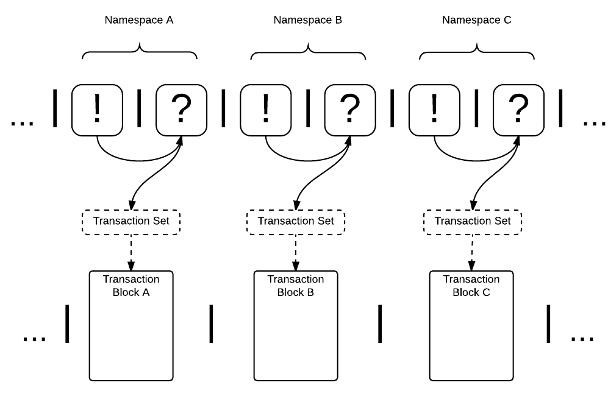

Namespace Logic
=======================================
For a blockchain solution of internet scale to be realizable, it, like the internet, must possess an logic to reason about the “location” of a resource i.e who can access a resource and under what conditions? In contrast to many other blockchains, where addresses are flat public keys (or hashes thereof), RChain’s virtual address space will be partitioned into namespaces. **In a very general explanation, a namespace is a range of named channels.** Because channels are quite often implemented as data stores, a namespace is equivalently a set of contentious resources.

It has been established that two processes must share a named channel to communicate. What if multiple processes communicate over a single channel? Transactional nondeterminism is introduced under two general conditions which render a resource contentious and susceptible to race conditions:

::

                                    for(ptrn <- x){P\ :sub:`1`} | x!(@Q) | for(ptrn <- x){P\ :sub:`2`} 

The first race condition occurs when multiple clients in parallel composition compete to *receive* a data resource on a named channel. In this case P\ :sub:`1` and P\ :sub:`2` , are waiting, on the named channel, :code:`x`,  for the resource, :code:`@Q`, being sent on the channel, :code:`x`, by another process. The clients will execute their continuations if and only if the correct value is witnessed at that location. In other cases where many clients are competing, many reductions may be possible, but, in this case, only one of two may result. One where :code:`P\ :sub:`1`` receives :code:`@Q` first and one where :code:`P2` receives :code:`@Q` first, both of which (possibly) return different results when, :code:`@Q` is substituted into their respective continuations. The simple question remains, “ to which channel is the sender referring?”.

::

                                          x!(@Q\ :sub:`1`) | for(ptrn <- x){P} | x!(@Q\ :sub:`2`)
                                          
                                          
The second race condition occurs when two clients compete to send a data resource on a named channel. In this case, two clients are each competing to send a data resource, :code:`@Q`, to the client at the named channel, :code:`x`, but only one of two transactions may occur - one where the receiving client receives :code:`@Q\ :sub:`1`` first and one where it receives :code:`@Q\ :sub:`2`` first, both of which (possibly) return different results when substituted in continuation, :code:`P`.

A certain level of nondeterminism is unavoidable. It is the blessing that concurrency affords and accommodates. Later, in the section on consensus, we will describe how the consensus algorithm maintains replicated state by converging on one of the many possible transaction occurrences in a nondeterministic process. For now, observe how simply redefining a name constrains reduction in the first race condition:

::

          for(ptrn <- v){P\:sub:`1`} | x!(@Q) | for(ptrn <- x){P\:sub:`2`} → P\:sub:`2`{@Q/ptrn} | for(ptrn <- v){P\:sub:`1`}

--and the second race condition:

::

                        x!(@Q\:sub:`1`) | for(ptrn <- x){P} |u!(@Q\:sub:`2`) → P{@Q\:sub:`1`/ptrn} | u!(@Q\:sub:`2`)
                            
                            
In both cases, the channel, and the data resource being communicated, is no longer contentious simply because they now have different names - they are in separate namespaces. And because names are unguessable, resources are only (possibly) visible to process/contracts that can communicate with the namespace. CITATION Hence, sets of processes that occur over non-conflicting sets of named channels i.e sets of transactions in separate namespaces, may execute in parallel, as demonstrated below:

::

for(ptrn\:sub:`1`; … ;ptrn\:sub:`n` <- x\:sub:`1`; … ;x\:sub:`n`){P} | x\:sub:`1`; … ;x\:sub:`n`!(@Q\:sub:`1`; … ;@Q\:sub:`n`) → P{@Q\:sub:`1`; … ;@Q\:sub:`n`/ptrn\:sub:`1`; … ;ptrn:sub:`n`}

| for(ptrn\:sub:`1`; … ;ptrn\:sub:`n` <- v\:sub:`1`; … ;v\:sub:`n`){P} | v\:sub:`1`; … ;v\:sub:`n`!!(@Q\:sub:`1`; … ;@Q\:sub:`n`) → P{@Q\:sub:`1`; … ;@Q\:sub:`n`/ptrn\:sub:`1`;… ;ptrn:sub:`n`}

The asynchronous set of transactions occurring over the named channel, :code:`x`, and the asynchronous set of transactions occurring over named channel, :code:`v`, are double-blind; they are anonymous to each other unless introduced by a third process. This mechanism to isolate sets of process/contract interactions essentially partitions RChain’s address space into many independent transactional environments each of which are internally concurrent and may execute in parallel.

    
    Figure - Namespaces as Isolated Transactional Environments
    

Still, in this representation, the fact remains that resources are visible to processes/contracts which know the name of a channel and satisfy a pattern match. After partitioning the structure of transactional environments, how do we further refine what type of contract can interact with a resource if it belongs to the same namespace? - and the extent to which it may do so? For that we turn to definitions.

Namespace Definitions
=======================================================
**A namespace definition is a formulaic description of the minimum conditions required for a process/contract to function in a namespace.** In point of fact, the consistency of a namespace is immediately and exclusively dependent on how that space defines a name, which may vary greatly depending on the intended function of the contracts the namespace definition describes.

A name satisfies a definition, or it does not; it functions, or it does not. The following namespace definition is implemented as an ‘if conditional’ in the interaction which depicts a set of processes sending a set of contracts to set of named addresses that comprise a namespace:

.. figure:: ../img/namespace-definitions
    :align: center
    :width: 2659
    
    Figure - A Namespace Definition  Implemented as an ‘If-conditional’
    

1. A set of contracts, contract\:sub:`1` … contract\:sub:`n` , are sent to the namespace address\:sub:`1` … address\:sub:`n`.

2. In parallel, a process listens for the input, contract, on every channel in the, :code:`address`, namespace. 

3. When a contract is received on any one of the channels, it is supplied to, :code:`if cond.`, which checks the namespace origin, the address of sender, the behavior of the contract, the structure of the contract, as well as the size of data the contract carries. 

4. If those properties are consistent with those denoted by the, :code:`address`, namespace definition, continuation, :code:`P`, is executed with, :code:`contract`, as its argument.

A namespace definition effectively bounds the types of interactions that may occur in a namespace - with every contract existing in the space demonstrating a common and predictable behavior. That is, the state alterations invoked by a contract residing in a namespace are necessarily authorized, defined, and correct for that namespace. This design choice makes fast datalog-style queries against namespaces very convenient and exceedingly useful.

A namespace definition may control the interactions that occur in the space, for example, by specifying:

* Accepted Addresses
* Accepted Namespaces
* Accepted Behavioral Types
* Max/Min Data Size
* I/O Structure

A definition may, and often will, specify a set of accepted namespaces and addresses which can communicate with the agents it defines.

Note the check against behavioral types in the graphic above. This exists to ensure that the sequence of operations expressed by the contract is consistent with the safety specification of the namespace. Behavioral type checks may evaluate properties of liveness, termination, deadlock freedom, and resource synchronization - all properties which ensure maximally “safe” state alterations of the resources within the namespace. Because behavioral types denote operational sequencing, the behavioral type criteria may specify post-conditions of the contract, which may, in turn, satisfy the preconditions of a subsequent namespace. As a result, the namespace framework supports the safe composition i.e chaining together, of transactional environments.

Composable Namespaces - Resource Addressing
=============================================================================
Until this point, we’ve described named channels as flat, atomic entities of arbitrary breadth. With reflection, and internal structure on named channels, we achieve depth.

A namespace can be thought of as a URI (Uniform Resource Identifier), while the address of a resource can be thought of as a URL (Uniform Resource Locator). The path component of the URL, :code:`scheme://a/b/c`, for example, may be viewed as equivalent to an RChain address. That is, a series of nested channels that each take messages, with the named channel, :code:`a`, being the “top” channel.

Observe, however, that URL paths do not always compose. Take :code:`scheme://a/b/c` and :code:`scheme://a/b/d`. In a traditional URL scheme, the two do not compose to yield a path. However, every flat path is automatically a tree path, and, as trees, these *do* compose to yield a new tree :code:`scheme://a/b/c+d`. Therefore, trees afford a composable model for resource addressing.

.. figure:: .. img/namespaces-as-tree-paths.png
    :align: center
    :width: 1617
    
     Figure - Composable Tree Paths
    
Above, unification works as a natural algorithm for matching and decomposing trees, and unification-based matching and decomposition provides the basis of query. To explore this claim let us rewrite our path/tree syntax in this form:

::

scheme://a/b/c+d ↦ s: a(b(c,d))

Then adapt syntax to the I/O actions of the rho-calculus:

::

                     s!( a(b(c,d)) )

          for( a(b(c,d) <- s; if cond ){ P }
          
          
The top expression denotes output - the resource address :code:`a(b(c,d)` at the named channel :code:`s`. The bottom expression denotes input. For the pattern that matches the form :code:`a(b(c,d))`, coming in on channel :code:`s`, if some precondition is met, execute continuation :code:`P`, with the address :code:`a(b(c,d)` as an argument. Of course, this expression implicates :code:`s`, as a named channel. So the adapted channel structure is represented:

.. figure:: .. img/namespaces-as-trees
    :align: center
    :width: 567
    
    Figure - URL Scheme as Nested Channels in Tree Structure
    
    
Given an existing address structure, and namespace access, a client may query for and send to names within that address structure. For example, when the I/O processes are placed in concurrent execution, the following expression denotes a function that places the quoted processes, (Q,R) at the location, a(b(c,d)):

::

for( a(b(c,d) ) <- s; if cond){ P } | s!( a(b(@Q,@R)) )

The evaluation step is written symbolically:

::

for( a(b(c,d)) <- s; if cond ){ P } | s!( a(b(@Q,@R)) ) → P{ @Q/c, @R/d }

That is, :code:`P` is executed in an environment in which :code:`c` is substituted for :code:`@Q`, and :code:`d` is substituted for :code:`@R`. The updated tree structure is represented as follows:

.. figure:: .. img/tree-structure-substituted.png
    :align: center
    :width: 1688
    
    Figure - Placing Processes at Channels

Note that every channel with sub-structure is a namespace and, therefore, has an unguessable name and (possibly) imposes a namespace definition to manage access to itself and it's sub-structure. This "address" realizes a namespace as the named channel :code:`s` with minimal internal structure. In practice, the internal structure of a named channel is an n-ary tree of arbitrary depth and complexity, and the "top" channel, in this case :code:`s`, is but one of :code: `s\ :sup:`n`` names within the "top-level" namespace :code:`s`. Nevertheless, this structure represents a step-by-step adaptation to what is, arguably, the most widely used internet addressing standard in history. RChain achieves the compositional address space necessary for private, public, and consortium visibility by way of namespaces. However, the obvious use-case addresses scalability. Not by chance, and not surprisingly, namespaces offer the framework for RChain’s sharding solution.

