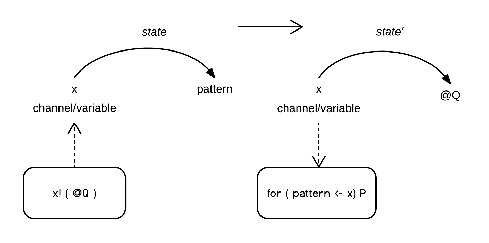

.. _rhovm:

******************************************************************
Execution Model
******************************************************************

Introduction
==================================================================

To begin, a client writes a program (contract) in Rholang. The contract is compiled into bytecode and fed to the **Rho Virtual Machine** (RhoVM).

It is useful to reiterate that each virtual machine corresponds to a state transition table. Given a machine state configuration, a legal transition, and an external event to trigger it, the transition is applied and the machine is run to its next state. In the case of the RhoVM, state, transitions, and events are expressed in bytecode.

+-------------------+--------------+----------------+------------+
| **Current state** | **Input**    | **Post-state** | **Output** |
+-------------------+--------------+----------------+------------+
| S1                | bytecode     | S1'            | bytecode'  |
+-------------------+--------------+----------------+------------+
| ...               | ...          | ...            | ...        |
+-------------------+--------------+----------------+------------+
| Sn                | bytecode     | Sn'            | bytecode'  |
+-------------------+--------------+----------------+------------+

The two dynamic bindings of a program at runtime are *environment* and *state*, which are the binding of names to locations and of locations to values, respectively. **CITE**

    
    *Figure - Dynamic Runtime Bindings*

Each instance of the VM maintains a set of environments into which the bindings of locations to values will be committed. Commits are realized by the rho-calculus I/O reduction semantics, which consist of a single substitution/evaluation rule:

::

    for ( pattern <- x )P | x! ( @Q ) -> P { @Q/pattern }

On some VM thread, the output term :code:`x!` commits the code of a process :code:`@Q` to the location :code:`x`. On another VM thread running concurrently, the input term :code:`for ( pattern <- x )P` waits for a generic pattern :code:`pattern` to appear at the location :code:`x`. When :code:`pattern` is matched at the location :code:`x`, :code:`P` is executed in an environment where :code:`@Q` is bound to :code:`pattern`. The synchronization of input and output at :code:`x` is the event required for a state transition to occur.

Reduction affects the values of a persisted key-value database, where channel names are keys that map to locations that map to values.

[ Digram similar to one above, except with { key/name, channel/location }

Note that, because "name" and "location" are both represented as :code:`x` in the following example, the mapping is depicted from name (key), directly to value. The output term :code:`x!(@Q)` places the value :code:`@Q` at the location denoted by the key :code:`x` , while the input term simultaneously looks for a value that meets a pattern requirement:

    
    *Figure - Dynamic Binding of Key to Value and Rho-Calculus I/O*

This depiction raises an important point. At first glance, the output term, which assigns :code:`@Q` to the location denoted by the key :code:`x` appears to constitute a state transition itself, by nature of its function. However, it is not an *observed* state transition. Only when the input term *observes* a value at :code:`x`, does evaluation occur. This obvservability requirement can be easily enforced at compile-time. This is the basic synchronization constraint which prevents DDoS attacks by repeated invocation of :code:`x!(@Q)`.

A transition could be anything from updating a routine from blocking to non-blocking status, to incrementing a PC register, **to updating a location in local memory REVISIT**. The monadic treatment of channels allows for higher-level constructs. Locations may be bound to and nested within many channels. For example, in addition to local storage, a channel may be bound to a network-address supported by an advanced message queuing protocol (AMQP).

A node operator listening on a live data stream that is receiving transaction blocks:

::

    for ( pattern <- stream ) | stream! ( block ) -> P { block/pattern }

In this case, the I/O pair is satisfied by two node operators, one writing a block to a stream and one reading a block from a stream. In this use-case, node operators are communicating through an AMQP, where channels represent network addresses. This case may be composed of a subset of lower-level transitions, the successful application of which yields this transition.

The current state configuration and instruction set of the VM, as well as the history of state configurations and bytecode differences are stored stored. We are required to apply the consensus algorithm when, and only when, node operators have conflicting histories of the observable state and transitions of an instance of RhoVM.

Executed bytecode instructions constitute transactions which are subjected to consensus to produce transaction blocks and then written to storage. By extension, transaction blocks represent verifiable snapshots of the state configurations and transitions of an instance of the Rho Virtual Machine.

To summarize:

1. when we refer to RhoVM, we are referring to the composition of an execution engine and a key-value database. 
2. The rho-calculus I/O semantics, where channels correspond to keys, substitute one value for another.
3. Substitutions manifest differences in the VM bytecode. Those differences are subjected to consensus, and written to storage.

Scalability
-------------------------------------------------------------------

From the perspective of a traditional software platform, the notion of “parallel” VM instances is redundant; it is assumed that VM instances operate independently of each other. Hence, there is no "global" RhoVM. At any given moment, there is a multiplex of replicated VM instances running on nodes across the network - each executing and validating state transitions for their associated namespaces. Because an instance of RhoVM exists for each namespace, the distributed key-value database, which stores the state of the VM, also exists for each.

The global state of RhoVM (if such a global data structure existed) would be an enormous, shared tuplespace consisting of all the keys and values that ever existed on the platform. Fortunately, that method for 

This design choice of many virtual machines executing "in parallel" constitutes system-level concurrency on the RChain platform, where instruction-level concurrency is given by Rholang. Hence, when this publication refers to a single instance of RhoVM, it is assumed that there are a multiplex of RhoVM instances simultaneously executing a different set of contracts in a different namespace.

Compilation Environment
================================================

To allow clients to execute on the VM, we’ll build a compiler pipeline that starts with Rholang source-code that is then compiled into intermediate representations (IRs) that are progressively closer to bytecode, with each translation step being either provably correct, commercially tested in production systems, or both. This pipeline is illustrated in the figure below:

.. figure:: ../img/compilation_strategy.png
    :width: 1200
    :align: center
    :scale: 50
    
    *Figure - RChain Compilation Strategy*
    
 
1. **Analysis**: From Rholang source-code, or from another smart contract language that compiles to Rholang, this step includes:

    a) analysis of computational complexity
    b) injection of code for the rate-limiting mechanism
    c) formal verification of transaction semantics
    d) desugaring of syntax
    e) simplification of functional equivalencies

2. **Transcompilation**: From Rholang source-code, the compiler:

    a) performs a simple source-to-source compilation from Rholang to Rosette source-code, which will eventually be executed on the     Rosette VM.

3. **Analysis**: From Rosette source-code, the compiler performs:
    
    a) lexical, syntactic, and semantic analysis of the Rosette syntax, construction of the AST; and
    b) synthesizes a Rosette intermediate representation

4. **Optimization**: From Rosette IR, the compiler:

    a) optimizes the IR via redundancy elimination, sub-expression elimination, dead-code elimination, constant folding, induction variable identification and strength simplification
    b) synthesizes bytecode to be executed on Rosette VM
    
For more details `join`_ the `#rhovm`_ channel on the RChain Slack here. Early compiler work can be seen on `GitHub`_.

.. _GitHub: https://github.com/rchain/Rosette-VM
.. _#rhovm: https://ourchain.slack.com/messages/coop/
.. _join: http://slack.rchain.coop/

What Is Rosette?
------------------------------------------------

Rosette is a reflective, object-oriented language that achieves concurrency via actor semantics. The Rosette system (including the Rosette virtual machine) has been in commerical production since 1994. Because of its demonstrated reliability, RChain Cooperative has committed to completing a clean-room reimplementation of Rosette VM in Scala. There are two main benefits of doing so. First, the Rosette language satisfies the instruction-level concurrency requirements demanded by a scalable design. Second, Rosette VM was intentionally designed to support multi-computer systems of an arbitrary amount of processors. For more information, see `Mobile Process Calculi for Programming the Blockchain`_. 

.. _Mobile Process Calculi for Programming the Blockchain: http://mobile-process-calculi-for-programming-the-new-blockchain.readthedocs.io/en/latest/

Execution Strategy
================================================

This section gives a high-level view of RChain's contract execution strategy.

.. figure:: .. /img/execution_diagram.png
    :width: 1792
    :align: center
    :scale: 50
    
    *Figure - RChain Execution Sequence*

This sequence portrays a client request for a contract that is sent to all node operators validating transactions for the superset of contracts in the namespace of the requested contract. On each node, the request is recieved by a VM system contract (thread) that handles work requests.

For brevity, this representation sidesteps the consensus requirement of each system contract. In practice, each system contract may posess many protocols that are themselves subject to consensus. During the course of each contract, many transactions will be requested and need to be committed before progress on other parts of the contract can be made.
 
    
Execution Environment - RhoVM
================================================

In the section on rho-calculus, we presented the rho-calculus reduction semantics as a faithful representation of an atomic transaction.

Rate-limiting Mechanism
---------------------------------------------------

RhoVM will implement a rate-limiting mechanism that is related to some calculation of processing, memory, storage, and bandwidth resources. This mechanism is needed in order to recover costs for the hardware and related operations. Although Bitcoin and Ethereum (Gas) have similar needs, the mechanisms are different. Specifically, the metering will not be done at the VM level, but will be injected in the contract code during the analysis phase of compilation.

Model Checking and Theorem Proving
----------------------------------------------------

In the RhoVM and potentially in upstream contracting languages, there are a variety of techniques and checks that will be applied during compile-time and runtime. These help address requirements such as how a developer and the system itself can know a priori that contracts that are well-typed will terminate. Formal verification will assure end-to-end correctness via model checking (such as in SLMC) and theorem proving (such as in Pro Verif). Additionally, these same checks can be applied during runtime as newly proposed assemblies of contracts are evaluated.

Discovery Service
----------------------------------------------------

An advanced discovery feature that will ultimately be implemented enables searching for compatible contracts and assembling a new composite contract from of other contracts. With the formal verification techniques, the author of the new contract can be guaranteed that when working contracts are plugged together they will work as well as a single contract.
