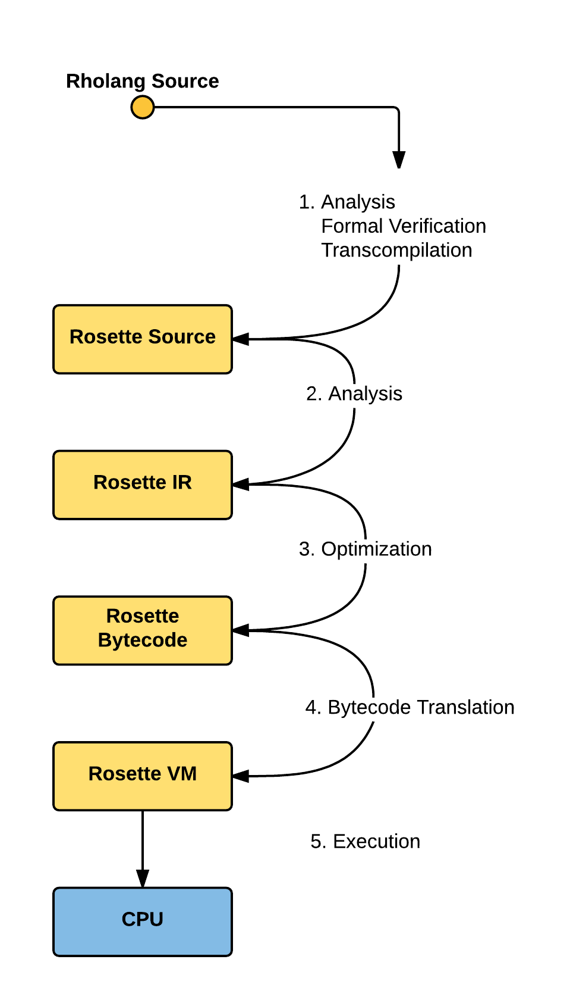

.. _rhovm:

******************************************************************
Execution Model - RhoVM
******************************************************************

Introduction
==================================================================

To begin, a client writes a program (contract) in Rholang. The contract is compiled and passed to an instance of the **Rho Virtual Machine** (RhoVM) and executed. Given an environment and runnable bytecode, RhoVM performs state changes (transactions) on the data that is stored in a distributed key-value database, where a key is a location in memory (name), on some machine in the network, that maps to a value, which may, in practice, be any form of data supported by the platform.

From the perspective of a traditional software platform, the notion of “parallel” VM instances is redundant; it is assumed that VM instances operate independently of one another. Hence, there is no global “RhoVM”. At any given moment there is a multiplex of replicated VM instances running on nodes across the network - each executing and validating state transitions for the shard(s) or, as we’ve referred to them thus far, namespaces, to which they're subscribed.

This design choice of many virtual machines executing "in parallel" is machine-level concurrency on the RChain platform, where processor and instruction-level concurrency are given by Rholang. It is also in direct contrast to the “global virtual machine” model which constrains every state transition, defined by every contract on the platform, to be executed *sequentially*, notwithstanding their associated dependencies. Hence, where there is a discussion held in this publication concerning a single RhoVM, it is assumed that there are a multiplex of RhoVMs executing in parallel for a different set of contracts in a different namespace.

Programming Environment
================================================

Like the language, RhoVM is derived from the rho-calculus. Necessarily, there will be a tight coupling between Rholang and its VM, ensuring correctness. To allow clients to execute state transitions on the VM, we’ll build a compiler pipeline that starts with Rholang code that is then compiled into intermediate representations (IRs) that are progressively closer to bytecode, with each translation step being either provably correct, commercially tested in production systems, or both. This pipeline is illustrated in the figure below:

    
    *Figure - RChain Execution Strategy*
    
    
Let’s describe these steps in more detail:
 
1. **Analysis**: From Rholang source-code, or from another smart contract language that compiles to Rholang, this step includes:

    a) injection of code for the rate-limiting mechanism
    b) formal verification of transaction semantics
    c) desugaring of syntax
    d) simplification of functional equivalencies

2. **Transcompilation**: From Rholang source-code, the compiler:

    a) performs a simple source-to-source compilation from Rholang to Rosette source-code, which will eventually be executed on the     Rosette VM.

3. **Analysis**: From Rosette source-code, the compiler performs:
    
    a) lexical, syntactic, and semantic analysis of the Rosette syntax, constructs an AST and;
    b) synthesizes a Rosette intermediate representation

4. **Optimization**: From Rosette IR, the compiler:

    a) optimizes the IR via redundancy elimination, sub-expression elimination, dead-code elimination, constant folding, induction variable identification and strength simplification
    b) synthesizes bytecode to be executed on Rosette VM
    
5. **Execution**: Once passed to Rosette VM, the interpreter:

    a) retrieves (environmental variables)??? from decentralized storage layer
    b) executes the bytecode
    c) returns the updated contract to the storage layer in bytecode form
    
For more details see the #rholang channel on the RChain Slack `here`_. Early compiler work can be seen on `GitHub`_.

.. _GitHub: https://github.com/rchain/Rosette-VM
.. _here: https://ourchain.slack.com/messages/coop/

Rate-limiting Mechanism
---------------------------------------------------

RhoVM will implement a rate-limiting mechanism that is related to some calculation of processing, memory, storage, and bandwidth resources. This mechanism is needed in order to recover costs for the hardware and related operations. Although Bitcoin and Ethereum (gas) have similar needs, the mechanisms are different. Specifically, the metering will not be done at the VM level, but will be injected in the contract code (via source-to-source translation that is part of the compilation process).

Model Checking and Theorum
----------------------------------------------------

In the RhoVM and potentially in upstream contracting languages, there are a variety of techniques and checks that will be applied during compile-time and runtime. These help address requirements such as how a developer and the system itself can know a priori that contracts that are well-typed will terminate. Formal verification will assure end-to-end correctness via model checking (such as in SLMC) and theorem proving (such as in Pro Verif). Additionally, these same checks can be applied during runtime as newly proposed assemblies of contracts are evaluated.

Discovery Service
----------------------------------------------------

An advanced discovery feature that will ultimately be implemented enables searching for compatible contracts and assembling a new composite contract from of other contracts. With the formal verification techniques, the author of the new contract can be guaranteed that when working contracts are plugged together they will work as well as a single contract.
