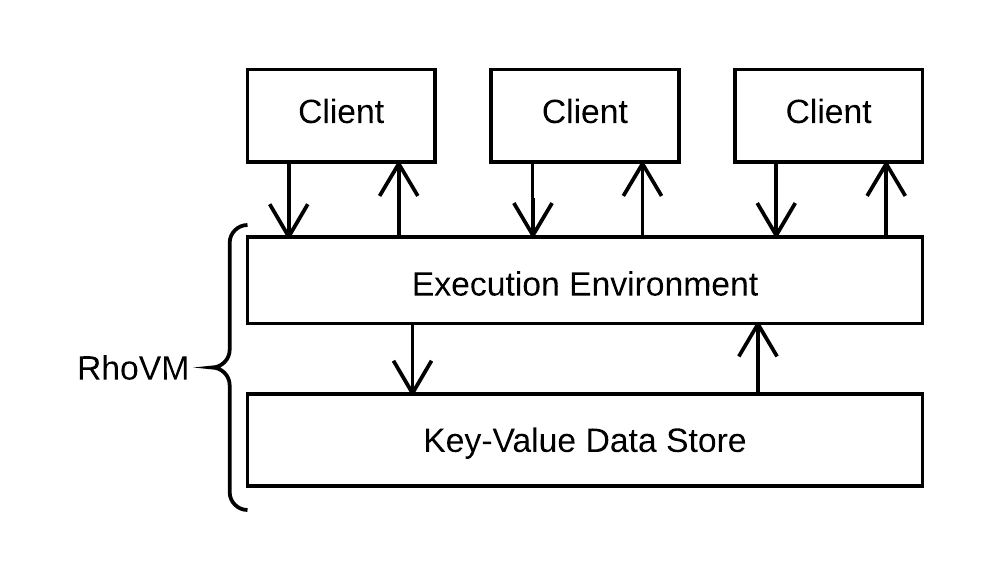

.. _rhovm:

******************************************************************
Execution Model
******************************************************************

Overview
==================================================================

Each instance of the **Rho Virtual Machine** (RhoVM) maintains an environment that repeatedly applies the low-level rho-calculus reduction rule, expressed in the high-level Rholang contracting language, to the elements of a persistent key-value data store [#]_.

    
    *Figure - RhoVM as a back-to-back key-value store and execution engine*
   

The execution of a contract affects the *environment* and *state* of an instance of RhoVM. In this case, the useage of "environment" does not refer to the execution environment exclusively, but to the configuration of the key-value structure. Environment and state are the mapping of names to locations in memory, and of locations in memory to values, respectively. Variables directly reference locations, which means that environment is equivalenty a mapping of names to variables. A program typically modifies one or both of these associations at runtime. Environmental modifications occur with the lexical scoping rules of Rholang, and values may be simple or complex.

.. figure:: ../img/bindings_diagram.png
    :align: center
    :scale: 50
    :width: 1017
    
    *Figure - Two-stage binding from Names to values*

RhoVM operates against a key-value data store. A state change of RhoVM is realized by an operation that modifies which key maps to what value. Since, like Rholang, RhoVM is derived from the rho-calculus model of computation, that operation is the low-level rho-calculus reduction rule. Effectively, the reduction rule, known as the "COMM" rule, is a substitution that defines a computation :code:`P` to be performed if a new value is observed at a key. A key is analogous to a name in that it references a location in memory which holds the value being substituted. In the following example, :code:`key` is a key and :code:`val` is the value being substituted:

::

    for ( val <- key )P | key! ( @Q ) -> P { @Q/val }

On some thread, the output process :code:`key!` assigns the code of a process :code:`@Q` to the location denoted by :code:`key`. On another thread running concurrently, the input process :code:`for ( val <- key )P` waits for a new value :code:`val` to appear at :code:`key`. When :code:`val` appears at :code:`key`, :code:`P` is executed in an environment where :code:`@Q` is bound to (substituted for) :code:`val`. This operation modifies the value that :code:`key` references i.e. :code:`key` previously mapped to :code:`val` but now it maps to :code:`@Q`. Therefore, a reduction is a state transition of RhoVM.

.. figure:: ../img/io_binding.png
    :align: center 
    :scale: 90
    :width: 1650
    
    *Figure - Reduction effecting a key-value data store*

The synchronization of an input and output process at :code:`key` is the event that triggers a state transition of RhoVM. At first glance, the output process, which assigns the value :code:`@Q` to the location denoted by :code:`key`, appears to constitute a state transition in itself. However, the rho-calculus reduction semantics have an *observability* requirement. For any future computation :code:`P` to occur, the reduction rule requires that the input process :code:`for ( val <- key) P` *observes* the assignment at :code:`key`. This is because only the input term defines future computation, which means that the output term alone is computationally insignificant. Therefore, no *observable* state transition occurs until the input and output terms synchronize at :code:`key`. This obvservability requirement is enforced at compile-time to prevent DDoS attacks by repeated output :code:`key!(@Q)` invocation.

It has been demonstrated that an application of the rho-calculus reduction rule, to a data element of a key-value data store, constitutes a state transition of an instance of the RhoVM. The goal, however, is to verify and maintain every state transition that ever occurs on an instance of the VM, which means that the configuration history of the key-value data store must be maintained through modification, hence it being a *persistent* data structure. Therefore, in addition to mapping to current values, each key maps to the verified history of reductions to occur at that location:

.. figure:: ../img/transaction_history.png
    :align: center
    :width: 2175
    :scale: 80
    
    *Figure - Reduction/transaction history of a location in memory*
    

:code:`keyn` maps to a list of reductions :code:`{ for(val1 <- keyn).P1 | keyn!(@Q1) … for(valn <- keyn).Pn | keyn!(@Qn) }`. The list of reductions is the history of value modifications committed to the location denoted by :code:`keyn`. What's more, the reduction history of a key is the transaction history of an address.

After a transaction/reduction is applied, it is subjected to consensus. Consensus verifies that the transaction history, :code:`{ for(val1 <- keyn).P1 | keyn!(@Q1) … for(valn <- keyn).Pn | keyn!(@Qn) }`, of :code:`keyn`, is consistently replicated across all nodes running that instance of RhoVM. Once histories are verified, the transaction is added to the list. The same consensus protocol is applied over the range of keys :code:`{ key1 -> val1 … keyn -> valn }` as transactions are committed to those locations.

By extension, transaction blocks represent sets of reductions that have been applied to elements of the persisted key-value store, and transaction histories represent verifiable snapshots of the state configurations and transitions of an instance of the Rho Virtual Machine. Note that the consensus algorithm is applied if, and only if, node operators propose conflicting reduction histories.

To summarize:

1. RhoVM is the composition of the rho-calculus reduction semantics, expressed in Rholang, and a persistent key-value data store. 
2. The rho-calculus reduction rule substitutes the value at a key for another value, where a named channel corresponds to a key, and values may be simple or complex.
3. Substitutions and transactions, which manifest as differences in the bytecode stored at a key. The accurate replication of those bytecode differences, across all nodes validating that instance of RhoVM, is verified via the consensus algorithm.

.. [#] The RhoVM "Execution Environment" will later be introduced as the "Rosette VM". The choice to use Rosette VM hinged on two factors. First, the Rosette system has been in commerical production for over 20 years. Second, Rosette VM's memory model, model of computation, and runtime systems provide the support for concurrency that RhoVM requires. RChain has pledged to perform a modernized re-implementation of Rosette VM, in Scala, to serve as the initial RhoVM execution environment.

A Brief Aside on Scalability
-------------------------------------------------------------------

From the perspective of a traditional software platform, the notion of “parallel” VM instances is redundant. It is assumed that VM instances operate independently of each other. Accordingly, there is no "global" RhoVM. Instead, there is a multiplex of RhohVM instances running on nodes across the network at any given moment - each executing and validating transactions for their associated namespaces.

This design choice constitutes system-level concurrency on the RChain platform, where instruction-level concurrency is given by Rholang. Hence, when this publication refers to a single instance of RhoVM, it is assumed that there are a multiplex of RhoVM instances simultaneously executing a different set of contracts for a different namespace.

Execution Environment - RhoVM
================================================

What Is Rosette?
------------------------------------------------

Rosette is a reflective, object-oriented language that achieves concurrency via actor semantics. The Rosette system (including the Rosette virtual machine) has been in commerical production since 1994. Because of Rosette's demonstrated reliability, RChain Cooperative has committed to completing a clean-room reimplementation of Rosette VM in Scala. There are two main benefits of doing so. First, the Rosette language satisfies the instruction-level concurrency semantics expressed in Rholang. Second, Rosette VM was intentionally designed to support a multi-computer (distributed) system operating on an arbitrary amount of processors. For more information, see `Mobile Process Calculi for Programming the Blockchain`_.

.. _Mobile Process Calculi for Programming the Blockchain: http://mobile-process-calculi-for-programming-the-new-blockchain.readthedocs.io/en/latest/

Model Checking and Theorem Proving
----------------------------------------------------

In the RhoVM and potentially in upstream contracting languages, there are a variety of techniques and checks that will be applied during compile-time and runtime. These help address requirements such as how a developer and the system itself can know a priori that contracts that are well-typed will terminate. Formal verification will assure end-to-end correctness via model checking (such as in SLMC) and theorem proving (such as in Pro Verif). Additionally, these same checks can be applied during runtime as newly proposed assemblies of contracts are evaluated.

Discovery Service
----------------------------------------------------

An advanced discovery feature that will ultimately be implemented enables searching for compatible contracts and assembling a new composite contract from of other contracts. With the formal verification techniques, the author of the new contract can be guaranteed that when working contracts are plugged together they will work as well as a single contract.

Compilation Environment
================================================

To allow clients to execute contracts on the VM, RChain has developed a compiler pipeline that starts with Rholang source-code. The source-code is then compiled into intermediate representations (IRs) that are progressively closer to bytecode, with each translation step being either provably correct, commercially tested in production systems, or both. This pipeline is illustrated in the figure below:

.. figure:: ../img/compilation_strategy.png
    :width: 1467
    :align: center
    :scale: 50
    
    *Figure - RChain compilation strategy*
    
 
1. **Analysis**: From Rholang source-code, or from another smart contract language that compiles to Rholang, this step includes:

    a) analysis of computational complexity
    b) injection of code for the rate-limiting mechanism
    c) formal verification of transaction semantics
    d) desugaring of syntax
    e) simplification of functional equivalencies

2. **Transcompilation**: From Rholang source-code, the compiler:

    a) performs a source-to-source translation from Rholang to Rosette source-code.

3. **Analysis**: From Rosette source-code, the compiler performs:
    
    a) lexical, syntactic, and semantic analysis of the Rosette syntax, construction of the AST; and
    b) synthesizes a Rosette intermediate representation

4. **Optimization**: From Rosette IR, the compiler:

    a) optimizes the IR via redundancy elimination, sub-expression elimination, dead-code elimination, constant folding, induction variable identification and strength simplification
    b) synthesizes bytecode to be executed by the Rosette VM
    
Rate-limiting Mechanism
---------------------------------------------------

The compilation pipeline will implement a rate-limiting mechanism that is related to some calculation of processing, memory, storage, and bandwidth resources. Because the rho-calculus redution rule is the atomic unit of computation on the RChain platform, the calculation of computation complexity is necessarily correlated to the amount of reductions performed per contract. This mechanism is needed in order to recover costs for the hardware and related operations. Although Bitcoin and Ethereum (Gas) have similar needs, the mechanisms are different. Specifically, the metering will not be done at the VM level, but will be injected in the contract code during the analysis phase of compilation.
    
For more details `join`_ the `#rhovm`_ channel on the RChain Slack here. Compiler work can be seen on `GitHub`_.

.. _GitHub: https://github.com/rchain/Rosette-VM
.. _#rhovm: https://ourchain.slack.com/messages/coop/
.. _join: http://slack.rchain.coop/

