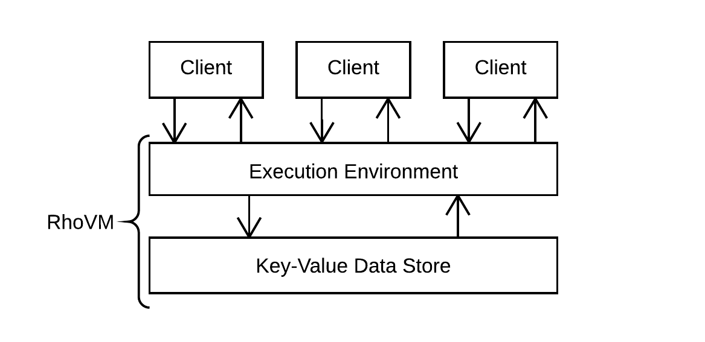
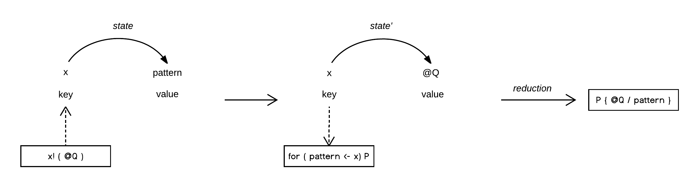
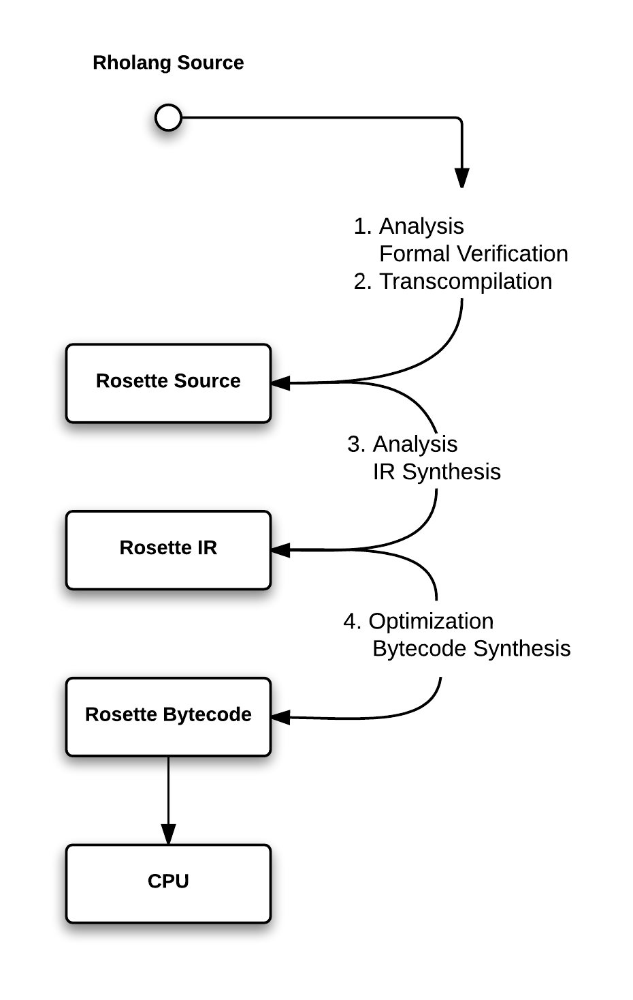

.. _rhovm:

******************************************************************
Modello di esecuzione
******************************************************************

Panoramica
==================================================================

Ogni istanza della **Rho Virtual Machine** (RhoVM) mantiene un ambiente che applica ripetutamente la regola di riduzione del rho-calcolus di basso livello, espressa nel linguaggio di contrattazione di alto livello di Rholang, agli elementi di un archivio dati persistente con valori-chiave [#]_. Lo "stato" di RhoVM è analogo allo stato della blockchain.

    
    *Figura - RhoVM come archivio di valori chiave back-to-back e motore di esecuzione*
   

L'esecuzione di un contratto influenza *l'ambiente* e *lo stato* di un'istanza di RhoVM. In questo caso, l'uso del termine "ambiente" non si riferisce esclusivamente all'ambiente di esecuzione, ma alla configurazione della struttura dei valori-chiave. Ambiente e stato sono rispettivamente la mappatura dei nomi rispetto alle posizioni nella memoria e delle posizioni nella memoria rispetto ai valori. Le variabili fanno riferimento direttamente alle posizioni, il che significa che l'ambiente è in modo equivalente una mappatura dei nomi rispetto alle variabili. Generalmente un programma modifica una o entrambe queste associazioni in fase di runtime. Le modifiche ambientali si verificano con le regole di scoping lessicali di Rholang e i valori possono essere semplici o complessi, cioè valori primitivi o programmi completi.

    
    *Figura - Associazione a due stadi da nomi a valori*

RhoVM opera rispetto a un archivio dati a valore chiave. **Un cambio di stato di RhoVM è realizzato da un'operazione che modifica quale chiave mappa rispetto a quale valore.** Poiché, come Rholang, RhoVM è derivato dal modello di calcolo di rho-calculus, quell'operazione è la regola di riduzione di basso livello del rho-calcolus. In effetti, la regola di riduzione, nota come regola "COMM", è una sostituzione che definisce un calcolo :code:`P` da eseguire se si osserva un nuovo valore in una chiave. Una chiave è analoga a un nome in quanto fa riferimento a una posizione in memoria che contiene il valore che viene sostituito. Nell'esempio seguente, :code:`key` è una chiave e :code:`val` è il valore che viene sostituito:

::

    for ( val <- key )P | key! ( @Q ) -> P { @Q/val }

Salvo consenso, questo è il modello computazionale di un protocollo concorrente che memorizza un contratto sulla blockchain. Su alcuni thread, il processo di outpu :code:`key!` memorizza il codice di un contratto :code:`@Q` nella posizione indicata da :code:`key`. Su un altro thread in esecuzione contemporanea, il processo di input :code:`for ( val <- key )P` attende un nuovo valore :code:`val` per comparire su :code:`key`. Quando qualche :code:`val` appare a :code:`key`, in questo caso :code:`@Q`, :code:`P` viene eseguito in un ambiente dove :code:`@Q` è sostituito a ogni occorrenza di :code:`val`. Questa operazione modifica il valore che :code:`key` riferisce  ad esempio :code:`key` precedentemente mappato ad un generico :code:`val` ma ora si associa al codice di un contratto :code:`@Q`, che qualifica una riduzione come transizione di stato di RhoVM.

    
    *Figura - Riduzione con effetto su un archivio dati valore-chiave*

La sincronizzazione di un processo di input e output su :code:`key` è l'evento che attiva una transizione di stato di RhoVM. A prima vista, il processo di output, che memorizza il contratto :code:`@Q` to the nella posizione indicata da :code:`key`, sembra costituire una transizione di stato in sé. Tuttavia, la semantica di riduzione del rho-calcolus ha un requisito di *osservabilità*. Perchè  ogni calcolo futuro :code:`P` avvenga, la regola di riduzione richiede che il processo di input :code:`for ( val <- key) P` *osservi* l'assegnazione a :code:`key`. Questo perché solo il termine di input definisce il futuro calcolo, il che significa che il termine di output da solo è computazionalmente insignificante. Pertanto, nessuna transizione *osservabile* dello stato si verifica fino a quando i termini di input e output non si sincronizzano su :code:`key`. Questo requisito di osservabilità è applicato in fase di compilazione per impedire attacchi DDoS da una ripetuta invocazione di output :code:`key!(@Q)`.

È stato dimostrato che un'applicazione della regola di riduzione del rho-calcolus, ad un elemento di dati di un archivio di dati valore-chiave, costituisce una transizione di stato di un'istanza di RhoVM. L'obiettivo, tuttavia, è verificare e mantenere ogni transizione di stato specificata da qualsiasi contratto che viene eseguito su un'istanza di RhoVM. Ciò significa che la cronologia di configurazione dell'archivio dati valore-chiave deve essere mantenuta tramite modifica, pertanto si tratta di una struttura dati *persistente*. Perciò, ogni chiave deve essere mappata nella cronologia verificata delle riduzioni per accadere in quella posizione:

    
    *Figura - Cronologia delle riduzioni/transazioni di una posizione in memoria*

Ogni chiave esegue una mappatura a un elenco di riduzioni che è, in effetti, la "cronologia delle transazioni" di un indirizzo. La cronologia delle transazioni :code:`{ for(val1 <- keyn).P1 | keyn!(@Q1), ... , for(valn <- keyn).Pn | keyn!(@Qn) } -> { P1{@Q1/val1}, ... , Pn{@Qn/valn} }` denota le modifiche apportate al contratto :code:`@Q`, dove :code:`@Qn` è la versione più recente in negozio. È importante riconoscere che questo schema è una transazione di primo livello sulla piattaforma RChain. I messaggi che vengono passati sono i contratti stessi, che si verificano più spesso nel sistema client o nelle interazioni sistema-sistema. Tuttavia, ogni contratto :code:`@Q` può, di per sé, eseguire molte transazioni di livello inferiore su valori più semplici.

Dopo che una transazione/riduzione viene applicata, questa è soggetta al consenso. Il consenso verifica che la cronologia delle transazioni, :code:`{ for(val1 <- keyn).P1 | keyn!(@Q1) … for(valn <- keyn).Pn | keyn!(@Qn) }`, of :code:`keyn`, è costantemente replicata su tutti i nodi che eseguono quell'istanza di RhoVM. Una volta verificate le cronologie delle transazioni, la transazione più recente viene aggiunta alla cronologia delle transazioni. Lo stesso protocollo di consenso viene applicato all'intervallo di chiavi :code:`{ key1 -> val1 … keyn -> valn }` mentre le transazioni vengono eseguite su tali posizioni.

Per estensione, i blocchi di transazione rappresentano insiemi di riduzioni applicate agli elementi dell'archivio dei valori-chiave persistente e le cronologie delle transazioni rappresentano istantanee verificabili delle configurazioni di stato e delle transizioni di un'istanza della Rho Virtual Machine. Si noti che l'algoritmo di consenso viene applicato se, e solo se, gli operatori di nodo propongono storie di riduzione in conflitto.

Per riassumere:

1. RhoVM è la composizione della semantica di riduzione del rho-calcolus, espressa in Rholang, e un archivio dati valore-chiave persistente. 
2. La regola di riduzione del rho-calcolus sostituisce il valore di una chiave per un altro valore, in cui un canale nominato corrisponde a una chiave e i valori possono essere semplici o complessi.
3. Le sostituzioni sono transazioni, che si manifestano come differenze nel bytecode memorizzato in una chiave. La replica accurata di quelle differenze bytecode, attraverso tutti i nodi che operano su quell'istanza di RhoVM, viene verificata tramite l'algoritmo di consenso.

.. [#] L’ "Execution Environment" di RhoVM verrà successivamente introdotto come "Rosette VM". La scelta di utilizzare Rosette VM dipende da due fattori. Innanzitutto, il sistema Rosette è stato in produzione commerciale per oltre 20 anni. In secondo luogo, il modello di memoria, il modello di calcolo e i sistemi di runtime di Rosette VM forniscono il supporto per la concorrenza richiesta da RhoVM. RChain si è impegnato a eseguire una reimplementazione modernizzata di Rosette VM, in Scala, per fungere da ambiente di esecuzione RhoVM iniziale.

Un breve discorso a parte sulla scalabilità
-------------------------------------------------------------------

Dal punto di vista di una piattaforma software tradizionale, la nozione di istanze VM “parallele” è ridondante. Si presume che le istanze VM funzionino indipenden "globale". Invece, esiste un multiplex di istanze di RhoVM che operano in modo indipendente su nodi attraverso la rete in qualsiasi momento - ciascuna eseguendo e convalidando le transazioni per i loro frammenti associati, o come ci siamo riferiti a loro, i namespace.

Questa scelta progettuale costituisce una concorrenza a livello di sistema sulla piattaforma RChain, in cui la concorrenza a livello di istruzioni è fornita da Rholang. Quindi, quando questa pubblicazione fa riferimento a una singola istanza di RhoVM, si presume che ci sia un multiplex di istanze di RhoVM che eseguono simultaneamente un diverso insieme di contratti per un diverso namespace.

Ambiente di esecuzione
================================================

Cos'è Rosette?
------------------------------------------------

Rosette è un linguaggio riflessivo orientato agli oggetti che ottiene la concorrenza attraverso la semantica degli attori. Il sistema Rosette (inclusa la Rosette Virtual Machine) è stato commercializzato dal 1994 in Automated Teller Machines. Per l'affidabilità dimostrata di Rosette, RChain Cooperative si è impegnata a completare una reimplementazione in versione clean-room di Rosette VM in Scala (con targeting per JVM). Ci sono due principali vantaggi nel farlo. Innanzitutto, il linguaggio Rosette soddisfa la semantica della concorrenza a livello di istruzioni espressa in Rholang. In secondo luogo, la Rosette VM è stata intenzionalmente progettata per supportare un sistema multi-computer (distribuito) che opera su un numero arbitrario di processori. Per ulteriori informazioni, consultare `Mobile Process Calculi per la programmazione della Blockchain`_.

.. _Mobile Process Calculi per la programmazione della Blockchain: http://mobile-process-calculi-for-programming-the-new-blockchain.readthedocs.io/en/latest/

Verifica del modello e dimostrazione del teorema
----------------------------------------------------

Nel RhoVM e potenzialmente nei linguaggi di contratto dell'upstream, ci sono una varietà di tecniche e verifiche che verranno applicate durante la compilazione e il runtime. Questi aiutano ad affrontare requisiti come il modo in cui uno sviluppatore e il sistema stesso possono sapere a priori che i contratti ben tipizzati termineranno. La verifica formale assicurerà la correttezza end-to-end tramite il model checking (come in SLMC) e la dimostrazione del teorema (come in Pro Verif). Inoltre, questi stessi controlli possono essere applicati durante il runtime mentre vengono valutati nuovi assiemi di contratti proposti di recente.

Servizio di scoperta
----------------------------------------------------

Una funzione di scoperta avanzata che verrà implementata alla fine, consente la ricerca di contratti compatibili e l'assemblaggio di un nuovo contratto composto da altri contratti. Con le tecniche di verifica formale, l'autore del nuovo contratto può avere la garanzia che quando i contratti di lavoro sono collegati insieme funzioneranno allo stesso modo come un unico contratto.

Compilazione
================================================

Per consentire ai clienti di eseguire contratti su RhoVM, RChain ha sviluppato una pipeline di compilatori che inizia con il codice sorgente di Rholang. Il codice sorgente Rholang subisce prima la transcompilazione nel codice sorgente Rosette. Dopo l'analisi, il codice sorgente Rosette viene compilato in una rappresentazione intermedia Rosette (IR), che subisce l'ottimizzazione. Da Rosette IR, il bytecode Rosette viene sintetizzato e passato alla VM per l'esecuzione locale. Ogni fase di traduzione all'interno della pipeline di compilazione è dimostrabilmente corretta, testata commercialmente nei sistemi di produzione o entrambe le cose. Questa pipeline è illustrata nella figura seguente:

    
    *Figura - Strategia di compilazione RChain*
    
 
1. **Analisi**: dal codice sorgente Rholang o da un altro linguaggio di contratto intelligente che compila in Rholang, questo passaggio include:

    a) analisi della complessità computazionale
    b) inserimento del codice per il meccanismo del fattore limitante
    c) verifica formale della semantica delle transazioni
    d) desugaring della sintassi
    e) semplificazione delle equivalenze funzionali

2. **Transcompilazione**: dal codice sorgente Rholang, il compilatore:

    a) esegue una traduzione source-to-source da Rholang al codice sorgente Rosette.

3. **Analisi**: dal codice sorgente Rosette, il compilatore esegue:
    
    a) analisi lessicale, sintattica e semantica della sintassi di Rosette, costruzione dell'AST; e
    b) sintetizza una rappresentazione intermedia di Rosette

4. **Ottimizzazione**: da Rosette IR, il compilatore:

    a) ottimizza l'IR tramite eliminazione della ridondanza, eliminazione delle sub-espressioni, eliminazione dei codici fuori uso, piegatura costante, identificazione delle variabili di induzione e semplificazione della forza
    b) sintetizza il bytecode che deve essere eseguito dalla Virtual Machine di Rosette
    
Meccanismo del fattore limitante
---------------------------------------------------

La pipeline di compilazione implementerà un meccanismo del fattore limitante che è correlato ad alcuni calcoli di risorse di elaborazione, memoria, archiviazione e larghezza di banda. Poiché la regola di riduzione del rho-calculus è l'unità atomica del calcolo sulla piattaforma RChain, il computo  della complessità del calcolo è necessariamente correlato all'ammontare delle riduzioni eseguite per ogni contratto. Questo meccanismo è necessario al fine di recuperare i costi per l'hardware e le operazioni correlate. Sebbene Ethereum (Gas) abbia esigenze simili, i meccanismi sono diversi. Nello specifico, la misurazione non verrà eseguita a livello di VM, ma verrà inserita nel codice del contratto durante la fase di analisi della compilazione.
    
Per ulteriori dettagli `collegati`_ al canale `#rhovm`_ sul Slack RChain qui. Il lavoro del compilatore può essere visto su `GitHub`_.

.. _GitHub: https://github.com/rchain/Rholang/tree/master/src/main/scala/rholang/rosette
.. _#rhovm: https://ourchain.slack.com/messages/rhovm/
.. _join: http://slack.rchain.coop/

