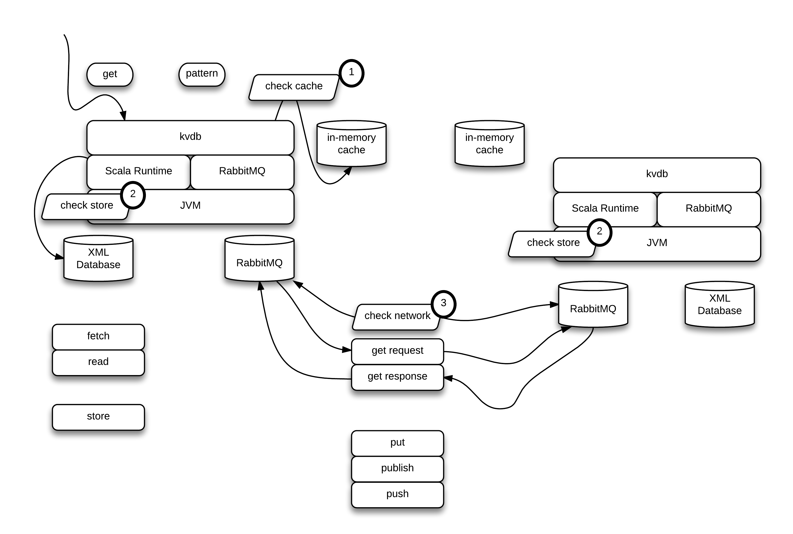

.. _storage_and_query:

************************************************************
Storage and Query
************************************************************

Overview
----------------------------------------

The Storage and Query network layer *appears* to each node as a local, asynchronously accessed database with rented storage. Behind the scenes, however, the Storage and Query layer is fully decentralized and subject to the consensus algorithm. In accordance with the micro-transaction capabilities inherent to blockchain solutions, dApp users on RChain pay for resources (compute, bandwidth, storage) using tokens. The RChain design considers all storage “conserved”, although not all data will be conserved forever. Instead, data storage will be rented and will cost producers of that data in proportion to its size, complexity, and lease duration. Consumers may also be required to pay for retrieval access. Data producers and consumers indirectly pay node operators.

The simple economic reason justifying leasing is that storage must be paid by someone; otherwise it cannot be stored reliably or “forever”. We’ve chosen to make the economic mechanism direct. It is an environmentally unfriendly idea that storage is made "free" only to subsidize it by an unrelated process. A small part of the real cost is measurable in the heat signatures of the data centers that are growing to staggering size. This charging for data as it is accessed also helps reduce "attack" storage i.e the storage of illegal content to discredit the technology.

A variety of data is supported, including public unencrypted json, encrypted BLOBs, or a mix. This data can also be simple pointers or content-hashes referencing off-platform data stored in private, public, or consortium locations and formats.

Data Semantics
----------------------------------------

The RChain blockchain will store the state, local transaction history, and the associated continuations of a contract. Like Ethereum, the RChain blockchain will also implement crypto-economically verifiable transactional semantics to create a linear temporal history of computation performed on the platform. Note that the math underlying this blockchain semantic structure is known as a Traced Monoidal Category. For more detail see Masahito Hasegawa's paper on this topic, `Recursion from Cyclic Sharing:Traced Monoidal Categories and Models of Cyclic Lambda Calculi`_.

.. _Recursion from Cyclic Sharing:Traced Monoidal Categories and Models of Cyclic Lambda Calculi: http://citeseerx.ist.psu.edu/viewdoc/download?doi=10.1.1.52.31&rep=rep1&type=pdf

============================================
Data Access Layer and Domain Specific Language
============================================

SpecialK is the DSL for data access, while KVDB is a distributed-memory data structure behind the DSL. SpecialK defines distributed data-access patterns in a consistent way, as shown below:

.. table:: Figure - SpecialK’s Data Access Patterns

+---------------------------+-----------------------------------------------------+-----------------------------+-----------------------------------+--------------------------------------+
|                           | **Item-level read and write (distributed locking)** | **Database read and write** | **Publish / Subscribe messaging** | **Publish / Subscribe with history** |
+===========================+=====================================================+=============================+===================================+======================================+
| **Data**                  | Ephemeral                                           | Persistent                  | Ephemeral                         | Persistent                           |
+---------------------------+-----------------------------------------------------+-----------------------------+-----------------------------------+--------------------------------------+
| **Continuation(K)** [#]_  | Ephemeral                                           | Ephemeral                   | Persistent                        | Persistent                           |
+---------------------------+-----------------------------------------------------+-----------------------------+-----------------------------------+--------------------------------------+
| **Producer Verb** [#]_    | Put                                                 | Store                       | Publish                           | Publish with History                 |
+---------------------------+-----------------------------------------------------+-----------------------------+-----------------------------------+--------------------------------------+
| **Consumer Verb**         | Get                                                 | Read                        | Subscribe                         | Subscribe                            |
+---------------------------+-----------------------------------------------------+-----------------------------+-----------------------------------+--------------------------------------+

*Figure - SpecialK’s Data Access Patterns*

From the point of view of the SpecialK DSL and API, when it performs a data-access action, such as the verb Get (with a pattern), it is indifferent to whether that data it is stored locally or remotely i.e on some other network node. There is a single query mechanism regardless.

The 2016 and prior SpecialK technology stack (Agent Services, SpecialK, and KVDB, with RabbitMQ and MongoDB) delivered a decentralized Content Delivery Network, although it was neither metered nor monetized. The SpecialK & KVDB components sit on top of MongoDB and an Advanced Message Queuing Protocol (ZeroMQ is being explored) to create the decentralized logic for storing and retrieving content, both locally and remotely. The current 1.0 implementations of SpecialK and KVDB are written in Scala and are in `GitHub`_.

.. _GitHub: https://github.com/leithaus/SpecialK

The query semantics vary depending on which level in the architecture is involved. At the SpecialK level, keys are prolog expressions, which are later queried via datalog expressions. Higher up in the architecture, prolog expressions of labels are used for storage, and datalog expressions of labels are used for query. In RChain, the SpecialK and KVDB layers will be reimplemented in Rholang (versus the prior implementation in Scala with custom implementation of delimited continuations and code serialization).

For more information, see `SpecialK & KVDB`_ – A Pattern Language for the Web.

.. _SpecialK & KVDB: https://docs.google.com/document/d/1aM5OIJWOyW89rHdUg6d9-YVbItdtxxiosP_fXZQaRdg/edit

=====================================================
KVDB - Data & Continuation Access, Cache
=====================================================

Data will be accessed using the SpecialK semantics, while physically being stored in a  decentralized, Key-Value Database known as "KVDB". A view of how two nodes collaborate to respond to a get request is shown below:

  
  *Figure - Decentralized Data Access in SpecialK*
  

1) The node first queries its in-memory cache for the requested data. Then if it is not found it,

2) queries its local store, and, if it is not found, stores a delimited continuation at that location, and 

3) queries the network. If and when the network returns the appropriate data, the delimited continuation is brought back in scope with the retrieved data as its parameter.

Why did RChain not select IPFS (InterPlanetary File System) for distributed memory? In addition to carrying centralization risks, IPFS uses a path to get to content, whereas SpecialK uses entire trees (and trees with holes in them) to get to content. IPFS has an intuitive path model, but that design begs the question on how to do queries. SpecialK started from the query side of addressing. Now, the RChain project can benefit from the IPFS work, including their hashing for addressing content, once the SpecialK query semantics are in place. SpecialK can also utilize a randomly generated flat key that has no correlation to the data.

P2P Node Communications
---------------------------------------------

The SpecialK decentralized storage semantics necessitate a node communications infrastructure. Similar to other decentralized implementations, the P2P communications component handles node discovery, inter-node trust, and communication. The current implementation uses RabbitMQ, although ZeroMQ is being considered.

.. [#] Note that by convention a continuation function is represented as a parameter named k.
.. [#] This is only a subset of the verbs possible under this decomposition of the functionality. The verb fetch, for example, gets the data without leaving a continuation around, if there is no data available.
