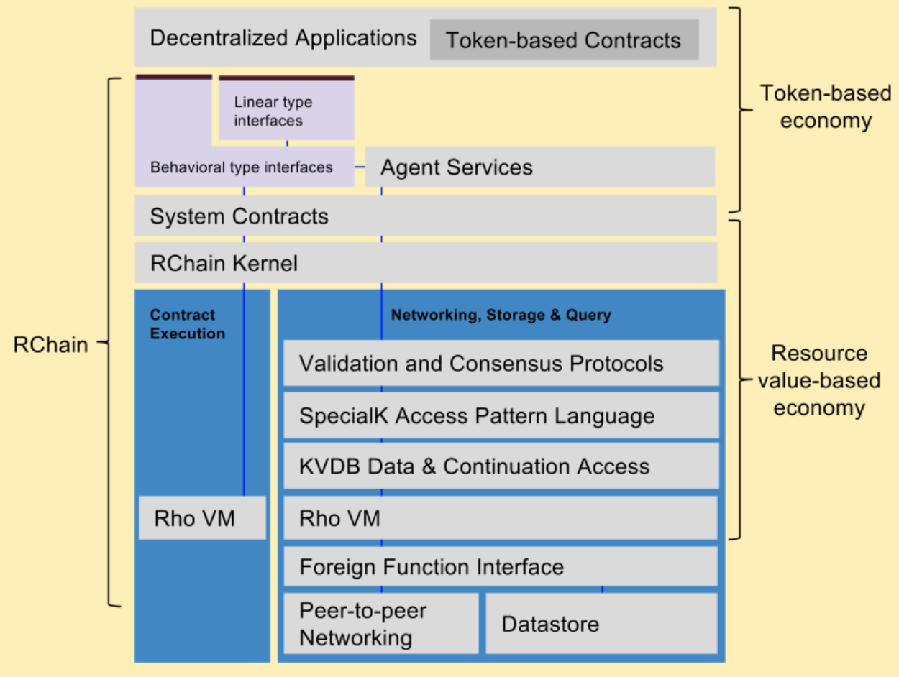

.. _architecture-overview:

################################################################################
Architecture Overview
################################################################################

The primary components of the architecture are depicted below:

Like all *layer cake* views of architecture, this diagram is a simplification. You’ll
notice familiar components expected in blockchain architectures, but also components
that might not be as expected. All data managed by the platform requires some associated
payment.

Introducing this from the bottom-up:

Blockchain contracts (aka smart contracts, protocols, or programs) will be written in RChain’s
flagship domain-specific language dubbed *Rholang*, (or in any contract language that compile
to Rholang) and then executed on the **Rho Virtual Machine** (RhoVM) on a number of native platforms.

A **P2P messaging network** & **key-value datastore** sit at the foundation of the architecture to
support base-line node-to-node communications and file management.

Above that, the **SpecialK Access Pattern Language Data** and the **KVDB Data & Continuation Access**
layers are an evolution of the existing SpecialK technology (including its decentralized
content delivery, key-value database, inter-node messaging, data access patterns, and
privacy protecting agent model). KVDB will be implemented in RChain’s domain language
and so relies on an instance of RhoVM and Rholang’s **Foreign Function Interface** to access
peer-to-peer networking and the datastore.

**Validation and Consensus Protocols** assures data validation and node consensus on contracts and
transactions for which each node is interested.

The **RChain Kernel** will load and execute contracts on the RhoVM as well as marshal contracts and
their metadata to/from the Storage & Query layers.

Smart Contracts include essential **System Contracts** as well as application-supplied contracts.
Application-supplied contracts will require protocol tokens that will typically be an instance
of a special system contract that introduces tokens. One or more system-defined protocol tokens
may also be included in the RChain System Contracts, similar to the Synereo AMP, BTC, ETH, and/or
others.

**Agent Services** introduces a DSL for secure agents, connections, and posts.

The **Rho API** provides access to the RhoVM, System Contracts, and Agent Services.
