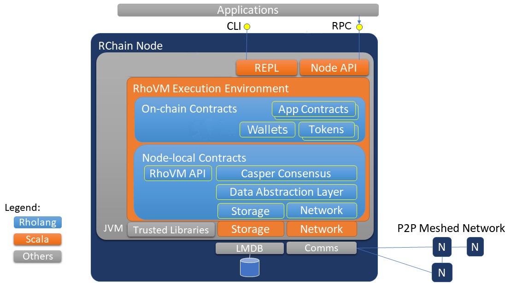
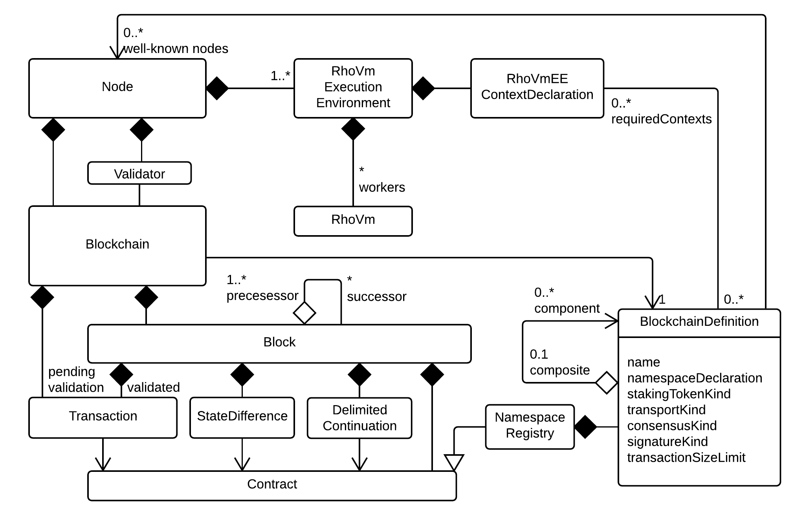

###################################
Architecture Overview
###################################
The primary components of the architecture are depicted below:

   Figure - The RChain Architecture

The execution architecture may rely on some operating-specific external components, but these are kept to a minium by running on the JVM. The RhoVM Execution Envirionment runs on the JVM, and then the individual RhoVM instances run within the RhoVM Execution Environment.

The **RhoVM Execution Environment** provides the context for contract execution, the lifecycle of individual RhoVM instances.   

Describing the remaining layers depicted, from the bottom-up:

**P2P Communication** supports node-to-node communications. This will be a TBD commercial-grade, open-source component such as ZeroMQ or RabbitMQ.

**Storage** is via MongoDB, a key-value datastore. The primary in-memory data structure is a radix tree (trie).

**Data Abstraction Layer** provides monadic access to data and other nodes consistently, as if they were local. This layer is an evolution of the SpecialK technology (including its decentralized content delivery, key-value database, inter-node messaging, and data access patterns). This layer is being implemented in Rholang, and so it relies on the RhoVM-EE and Rholang’s **Foreign Function Interface** to access P2P Communication and Storage.

**Consensus** (Casper Proof-of-Stake validation/consensus Protocol) assures node consensus on the state of each blockchain.

All RChain nodes include essential **System Contracts**, which are written in Rholang. System processes include those for running RhoVM instances, load balancing, managing dApp contracts, tokens, node trust, and others. 

The Token system contracts include those required to run protocols that interact beyond the local node. These are *protocol access tokens*. There are two types of PATs:
 * **Staking tokens** are those required to run consensus, including the **RChain Rev** token. Additional staking tokens may be introduced through official software releases. A staking token is required to pay for node *resources*. **Phlogiston** is RChain's measure of the cost of resources (similar to *gas* in Ethereum), and it is multi-dimensional and depends on usage of compute (depending on instruction), storage (depending on size and duration), and bandwidth (quality-of-service and throughput) resources.  See also section entitled "Rate-limiting Mechanism."

 + **Application tokens** are optional and may be required to run certain dApps. New application tokens can be introduced at any time by a dApp developer, and are similar to Ethereum's ERC20 tokens.

The **Rho API** provides access to Execution Environment and the Node. **Language Bindings** will be available for programming languages written against the JVM, and potentially others.  A **REPL** (Read, Execute, Print, and Loop) development tool will be provided. Each node will have a **Command Line Interface** CLI.  A **Node API** will expose features via HTTP and json RPC.

Concurrency vs. Parallelism
----------------------------------------
It is essential the reader understands the implications of concurrent execution. When we say, “concurrency”, we are not referring to the simultaneous execution of multiple processes. That is parallelism. *Concurrency* is a structural property which allows independent processes to compose into complex processes. Processes are considered independent if they do not compete for resources.

Since RChain has committed to concurrency in Rholang and RhoVM, we'll see that we will get parallelism and asynchronicity as “free” emergent properties. Whether the platform is running on one processor or 1,000,000 processors, the RChain design is scalable. Having said that, the reader of this document will notice design patterns of concurrent computation throughout.

###################################
Node and Blockchain Semantics
###################################
The following UML class diagram depicts the primary conceptual classes and structural relationships.

   Figure - RChain Blockchain Structural Semantics
