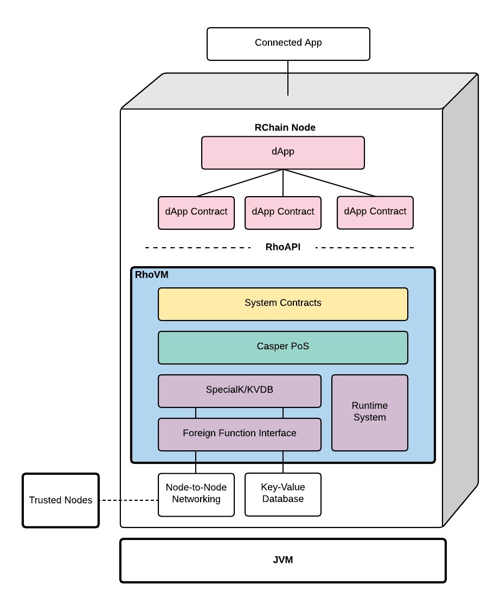

###################################
Architecture Overview
###################################
The primary components of the architecture are depicted below:

   Figure - The RChain Architecture

Introducing this from the bottom-up:

A **P2P messaging network** & **key-value datastore** sit at the foundation of the architecture to support base-line node-to-node communications (node stream) and file management (datastore).

Above that, the **SpecialK Access Pattern Language** and the **KVDB Data & Continuation Access** layers are an evolution of the existing SpecialK technology (including its decentralized content delivery, key-value database, inter-node messaging, data access patterns, and privacy protecting agent model). KVDB will be implemented in Rholang and so relies on an instance of RhoVM and Rholang’s **Foreign Function Interface** to access node-to-node networking and the datastore.

**Casper Proof-of-Stake** validation/consensus Protocol assures node consensus on the state of a RhoVM instance.

The **RChain Runtime System** manages contract execution, thread execution, code safety (security-type) verification, compilation, as well as the synchronization of contracts and their metadata between the KVDB/SpecialK storage layer and RhoVM.

RChain’s runtime environment includes essential **System Contracts** which are also written in Rholang and executed in the RhoVM. System processes include those for managing dApp contracts, tokens, node trust, namespace registration, and many others.

**DApp contracts** will require access protocol tokens that will be managed by the RChain token-issuance contract, and ultimately exchanged for RChain’s native platform access token, dubbed “Phlogiston”.

The **Rho API** provides access to the RhoVM, System Contracts, and Agent Services.
We'll detail these components in the sections below, from the bottom-up.

Concurrency
----------------------------------------
It is of the utmost importance that the reader understand the implications of concurrent execution. When we say, “concurrency”, we are not exclusively referring to the simultaneous execution of multiple processes. That is parallelism.

**Concurrency is a structural property which allows independent processes to communicate and compose into complex processes. Processes are considered independent if they do not compete for resources.**

We’ll see that, when we commit to concurrency, we get parallelism and asynchronicity for free. Whether the platform is running on one processor or 1,000,000 processors, the RChain design is scalable. Having said that, patterns of concurrency are absolutely fundamental to the RChain architecture and will be frequent to the astute reader.

Let’s begin.

