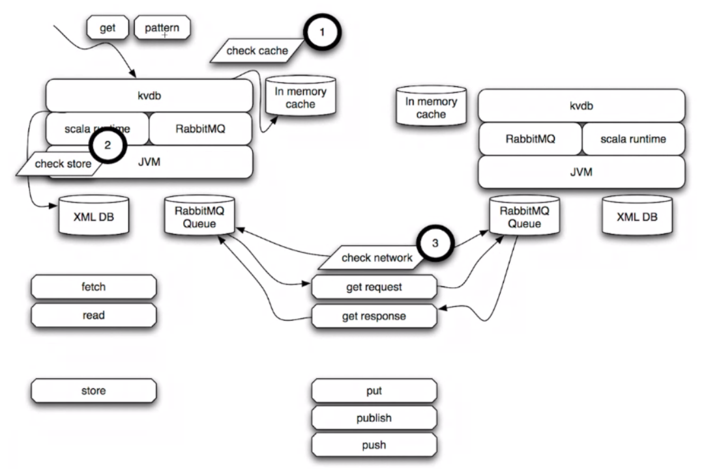

.. _special-k:

################################################################################
SpecialK: Data & Continuation Access, Cache
################################################################################

The current "RChain 1.0" technology stack delivers a decentralized CDN. Its primary
component is SpecialK, which sits on top of MongoDB and RabbitMQ to create the
decentralized logic for storing and retrieving content, both locally and remotely.

SpecialK implements distributed data-access patterns in a consistent way, as shown
below.

+------------------------------+-----------------------------------------------+-----------------+-------------------+----------------------+
|                              | Item-level read & write (distributed locking) | DB read & write | Pub/Sub messaging | Pub/Sub with history |
+==============================+===============================================+=================+===================+======================+
| **Data**                     | Ephemeral                                     | Persistent      | Ephemeral         | Persistent           |
+------------------------------+-----------------------------------------------+-----------------+-------------------+----------------------+
| **Continuation** [#f1]_      | Ephemeral                                     | Ephemeral       | Persistent        | Persistent           |
+------------------------------+-----------------------------------------------+-----------------+-------------------+----------------------+
| **Producer Verb (K)** [#f2]_ | Put                                           | Store           | Publish           | Publish with         |
|                              |                                               |                 |                   |                      |
|                              |                                               |                 |                   | history              |
+------------------------------+-----------------------------------------------+-----------------+-------------------+----------------------+
| **Consumer Verb**            | Get                                           | Read            | Subscribe         | Subscribe            |
+------------------------------+-----------------------------------------------+-----------------+-------------------+----------------------+

A view of how two nodes collaborate to respond to a get request is shown below:

1. The first node checks its in-memory cache, then if it is not found
2. checks its local store, then if it is not found stores a delimited
   continuation at that location, and
3. checks the network. When the network returns data, the delimited
   continuation is brought back in scope with the retrieved data as
   its parameter.

With the RChain platform, the implementation of the CDN will also evolve, although not in its fundamental design.

.. [#f1] By convention a continuation function is represented as a parameter named k.
.. [#f2] This is only a subset of the verbs possible under this decomposition of the
         functionality. The verb fetch, for example, gets the data without leaving a
         continuation around, if there is no data available.
